Université de Neuchâtel
Master en littérature

# TG: Édition de texte (numérique)
## Cours 1: introduction

Élodie Paupe 
chaire de philologie classique et d'histoire ancienne

14 septembre 2020

---
# Introduction

- [Informations pratiques](http://www5.unine.ch/descriptifs/plans2020-2021/plan_2020-2021_2LF2117.pdf). 
- Prérequis et préconnaissance.
- Conditions d'évaluations.
- [Calendrier](https://github.com/elodiepaupe/UNINE_edition-numerique/blob/master/README.md)
- _DigitalJura_ 20-21 novembre 2020

---
# Outils et matériel 

- Éditeur de code source: 
    - Mac/PC: _Sublime_ [[ici](https://www.sublimetext.com)], _Brackets_ [[ici](http://brackets.io)] ou _Visual Studio Code_ [[ici](https://code.visualstudio.com)]
    - L'utilisation d'_Oxygen_ [[ici](https://www.oxygenxml.com/)] est  recommandée. Une version d'essai est disponible pour une durée de 30 jours. 
- Logiciel pour l'analyse des données: 
    - _TXM_ [[ici](http://textometrie.ens-lyon.fr)]
- Cours déposés sur [GitHub](https://github.com/elodiepaupe/UNINE_edition-numerique)

---

# Objectifs du cours
- définir la philologie et sa méthode
- comprendre le vocabulaire spécifique à l'édition de texte
- réaliser un travail philologique sur un texte 
    - en vue de son édition selon une méthode classique
    - en vue de son édition numérique
- maîtriser les bases du XML-TEI 
- connaître les ressources qui permettent d'encoder en XML-TEI

--- 
```
<msItem>
<locus from="30" to="132">P. 30-132</locus>
<title>Evangelium secundum Mattheum</title>
<rubric>Incipit evangelium secundum Matthaeum</rubric>
<msItem>
<locus from="31">31</locus>
<incipit>Liber generationis</incipit>
<explicit>ad consummationem saeculi</explicit>
<finalRubric>
Explicit liber sancti evangangelii secundum Mathaeum
</finalRubric>
</msItem>
<msItem>
<locus from="116" to="130">116-130</locus>
<note>
récit de la Passion muni des signes + et <quote>O</quote>, grattés à partir de la <locus from="118">p. 118<locus>.
</note>
</msItem>
</msItem>
<msItem>
<locus from="132" to="198">P. 132-198</locus>
<title>Evangelium secundum Marcum</title>
<note>Prologue</note>
<rubric>Incipit prologus</rubric>
<incipit>
Marcus evangelista
<gap reason="sampling"/>
</incipit>
<bibl>
<abbr>RB</abbr> 607
</bibl>
<msItem>
<locus from="134">134</locus>
<title>sommaires 1-13</title>
<rubric>Incipit breviarium</rubric>
<incipit>
I. De Iohanne baptista
<gap reason="sampling"/>
</incipit>
<bibl>
<hi rend="small-caps">Wordsworth / White</hi>
I, p. 174-186 (versions CΘT)
</bibl>
</msItem>
```

---

```
<text xml:lang="la" n="24">
        <front>
            <head n="29">Epistula XXIX</head>
        </front>
        <body>
            <salute><persName type="récepteur" ref="indexnominum.xml#Severus">Severo fratri unanimo</persName> 
            <persName type="émetteur" ref="indexnominum.xml#Paulinus">Paulinus</persName>.</salute>
            <div n="1">
                <p>       
                    Inmoderatam, ut arguimus, in litteris vestris onus nostrum loquentibus caritatem apta 
                    atque moderata ad utilitatem nostram munerum gratia temperastis; 
                    necessario enim <persName type="émetteur" ref="indexnominum.xml#Paulin">peccatoribus</persName> 
                    et precatu deplorationis et habitu indigentibus pallia camelorum pilis texta misistis, 
                        quae nos in conspectu <persName type="Dieu" ref="indexnominum.xml#Dieu">altissimi</persName> 
                        stratos utilibus stimulis admonerent, 
                        dum asperitate setarum conpungimur, 
                        et <persName type="contemporain" ref="indexnominum.xml#pécheur">peccatorum nostrorum</persName> horrore conpungi 
                        atque intus spiritu conteri, 
                        dum extrinsecus terunt habitu. 
                        Multa praeterea in eorum usu de <persName type="persAT" ref="indexnominum.xml#saint">veterum recordatione sanctorum</persName> 
                        conformandae fidei emolumenta referuntur. 
                    Veniunt in mentem 
                    <quote type="tissé" cert="low" source="2 Rois"><!-- 1.8 -->translatus 
                    <persName type="persAT" ref="indexnominum.xml#Elia">Elias</persName></quote> 
                    et <quote type="tissé" cert="low" source="Matth."><!-- 3.4; Marc 1.6 -->praemissus 
                    <persName type="persNT" ref="indexnominum.xml#JBaptiste">Iohannes</persName></quote>, 
                        quorum alterum hispida setis zona cingebat, 
                        alium pili, ut scriptum est, camelorum hirto tegmine vestiebant. 
                    Reminiscimur etiam 
                    »<quote type="tissé" source="Ps." cert="high"><!-- 131.1 --><persName type="persAT" ref="indexnominum.xml#David">David</persName> 
                    et omnis mansuetudinis eius</quote>«, 
                        qua »<quote type="tissé" source="Ps." cert="medium"><!-- 50.10 -->contritum cor 
                        et humiliatum <persName type="Dieu" ref="indexnominum.xml#Dieu">deo</persName></quote> 
                        sacrificans induebat se cilicium; 
                        et <quote type="tissé" source="Ps." cert="medium"><!-- 68.11 -->operiebat in ieiunio animam suam</quote>«, 
                            ut eam spiritali saturitate contegeret. 
                </p>
            </div>
```

---

# Philologia ancilla litteraturae

---
## Définition
- gr. _φιλoλογἱα_ «goût pour la dialectique», «goût pour la littérature ou l'érudition»
- lat. _philologia_  «amour des lettres», «commentaire, explication des écrivains»

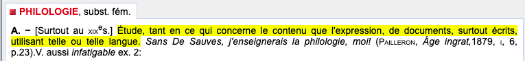

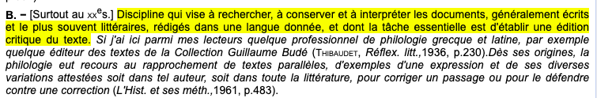
Source: TLFi

--- 
> Dans le sens étroit, plus actuel, [le terme de "philologie"] se réfère à la théorie et à la pratique éditoriale qui comportent la critique textuelle, mais également des pans interprétratifs. Il existe une distinction de fait entre une philologie "littéraire" (plus intéressée par les aspects des constructions littéraire, de mise en forme textuelle, de stylistique ou de métrique) et une philologie "linguistique" (plus ciblée sur la description des systèmes grapho-phonétique, morphologiques et syntaxique et sur les aspects lexicaux).
–– Trotter 2015: 2

--- 
## Philologie de l'édition pourquoi?
- Philologie généralement considérée comme particulièrement importante pour les textes des anciens jusqu'au Moyen Âge 
- Changement avec l'apparition de l'imprimerie
- Texte publié = **choix éditoriaux** qui diffèrent en fonction des pays, des écoles, des éditeurs, etc.
- Édition critique:
    - donner accès à un texte fiable et fidèle;
    - donner à consulter la matière qui a permis la reconstruction de ce texte;
    - donner à lire l'histoire d'un texte pour montrer sa genèse.
- Établissement de textes littéraires ou non

---
## Édition de texte: une tâche linguistique et littéraire
- Difficile de séparer ces deux champs qui s'alimentent
- Des disciplines spécialisées qui ont des méthodologies différentes
- Ecdotique (= théorie et pratique de l'édition de texte) au coeur d'un débat scientifique
    - Éditions "imitatives"
    - Éditions "reconstructionnistes"


---
# Études de cas
L'importance de la philologie par l'illustration.


---
## Une histoire de chameau

> Εὐκοπώτερόν ἐστιν **κάμηλον** διὰ τῆς τρυμαλιᾶς τῆς ῥαφίδος εἰσελθεῖν, ἢ πλούσιον εἰς τὴν βασιλείαν τοῦ θεοῦ εἰσελθεῖν.
–– _Septante_, _Mc_ 10.25

> _Facilius est **camelum** per foramen acus transire quam divitem intrare in regnum Dei._
> –– _Vulgate_,  _Mc_ 10.25

Il est plus facile à un **chameau** de passer par le trou de l'aiguille qu'à un riche d'entrer dans le Royaume de Dieu!

--- 
_Bible à l'Épée_ (1540)

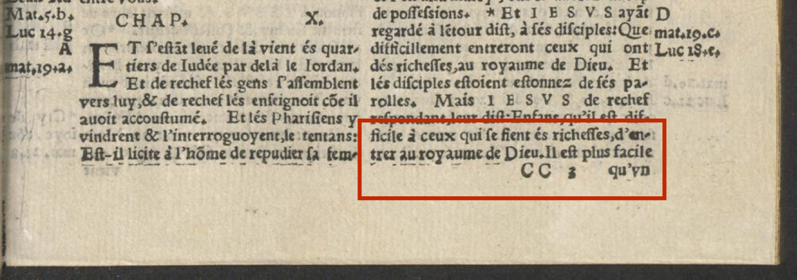|  
:---:|:---: 
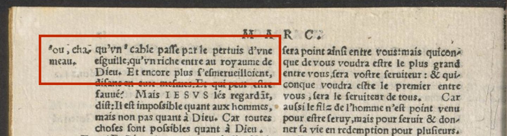| 

---

Une image qui étonne les commentateurs et les traducteurs des textes bibliques.

- IIe siècle: Origène choisit "chameau", mais signale que certains contemporains comprennent "corde de levage". 
- IVe-Ve siècles: Cyrille d'Alexandrie
    > Ici, il dit κάμηλον non pas la bête de somme, mais l'épais cordage auquel les marins attachent leurs ancres, il marque donc la chose comme quasiment impossible.

---
- κάμηλος "chameau"
- κάμιλος "corde"

État des lieux:

1. Éventuelle polysémie grecque?
1. Homophonie due à l'évolution vocalique du _êta_ avec le _iota_?

--- 
Une métaphore qui n'est pas uniquement chrétienne: 
> « Ceux qui ont traité nos enseignements de mensonges et qui les ont dédaignés, les portes du ciel ne s'ouvriront point pour eux ; ils n'entreront au paradis que quand un chameau passera par le trou d'une aiguille » 
–– Coran 7, 40

En arabe: 
- /jamalu/ → chameau
- /j m l / → grosse corde

---
## Une histoire de corne 

|||
| --- | ----------- |
|| _Moïse_ (1513-15) de Michel-Ange , détail du tombeau (entre 1505 et 1545) de Jules II, Église Saint-Pierre-aux-Liens, Rome. |

---

|||
| --- | ----------- |
| _Moïse_ détail du portail occidental, XVIe s., Cathédrale Notre-Dame, Lausanne. 

---


> וַיְהִ֗י בְּרֶ֤דֶת מֹשֶׁה֙ מֵהַ֣ר סִינַ֔י וּשְׁנֵ֨י לֻחֹ֤ת הָֽעֵדֻת֙ בְּיַד־מֹשֶׁ֔ה בְּרִדְתּ֖וֹ מִן־הָהָ֑ר וּמֹשֶׁ֣ה לֹֽא־יָדַ֗ע כִּ֥י **קָרַ֛ן** ע֥וֹר פָּנָ֖יו בְּדַבְּר֥וֹ אִתּֽוֹ׃
> –– Exode 34, 29

> Moïse descendit de la Montagne de Sinaï ayant les deux tables du témoignage dans sa main, en descendant de la montagne, et il ne savait pas que la peau de son visage **était /qaran/** parce qu'il avait parlé avec l'Éternel.

- קָרַ֛ן /qaran/
- _hapax legomena_: une seule occurence verbale de cette racine dans le texte biblique

---

> ὡς δὲ κατέβαινεν Μωυσῆς ἐκ τοῦ ὄρους, καὶ αἱ δύο πλάκες ἐπὶ τῶν χειρῶν Μωυσῆ· καταβαίνοντος δὲ αὐτοῦ ἐκ τοῦ ὄρους Μωυσῆς οὐκ ᾔδει ὅτι **δεδόξασται** ἡ ὄψις τοῦ χρώματος τοῦ προσώπου αὐτοῦ ἐν τῷ λαλεῖν αὐτὸν αὐτῷ.
–– _LXX_, _Ex_ 34.29 

[...] Moïse ne savait pas que l'aspect de la couleur de son visage **brillait** [...]

> _Cumque descenderet Moyses de monte Sinai, tenebat duas tabulas testimonii, et ignorabat quod **cornuta** esset facies sua ex consortio sermonis Domini._
–– _Vulgate_, _Ex_ 34.29

[...] et il ne savait pas que son visage était devenue **cornu** depuis qu'il avait parlé avec le Seigneur. [...]

---

- Jérôme accusé de "diaboliser la figure fondatrice du judaïsme"
- racine קרן "corne, bois"

---

> Puis Moïse redescendit du mont Sinaï, tenant en main les deux tablettes de l’acte de l’alliance. Il ne savait pas que la peau de son visage était devenue rayonnante pendant qu’il s’entretenait avec l’Eternel.
–– _Bible du Semeur_, _Ex_ 34.29

> Or, quand Moïse descendit du mont Sinaï, ayant à la main les deux tables de la charte, quand il descendit de la montagne, il ne savait pas lui Moïse, que la peau de son visage était devenue rayonnante[1] en parlant avec le Seigneur. 
–– _TOB_, _Ex_ 34.29
> [1] En hébr., _qâran_, apparenté à _qérèn_, qui signifie corne. D'où la traduction de la Vulg.: _son visage était cornu_, et l'iconographie qui en dépend.

--- 
## Une histoire numérique
| | | 
| --- | ---- |
| Venance Fortunat, _Carmina_, V, VIa

---

_carmen_  accompagné d'une lettre explicative

> Littera vero quae tinguitur in discendenti versiculo et tenetur in uno et currit in altero et, ut ita dicatur, et stat pro stamine et pro trama currit in tramite, ut esse potest in pagina licia litterata.
–– Venance Fortunant, _Carmina_, V, V

> Quant à la lettre peinte qui est dans le vers vertical, elle s'accroche à un vers et court dans un autre, et, pour ainsi dire, elle est fixe en tant que chaîne et, en tant que trame, elle court dans le tissu, pour autant qu'il est possible d'avoir sur une page une lice formée de lettres. (trad. Marc Reydellet)

--- 

|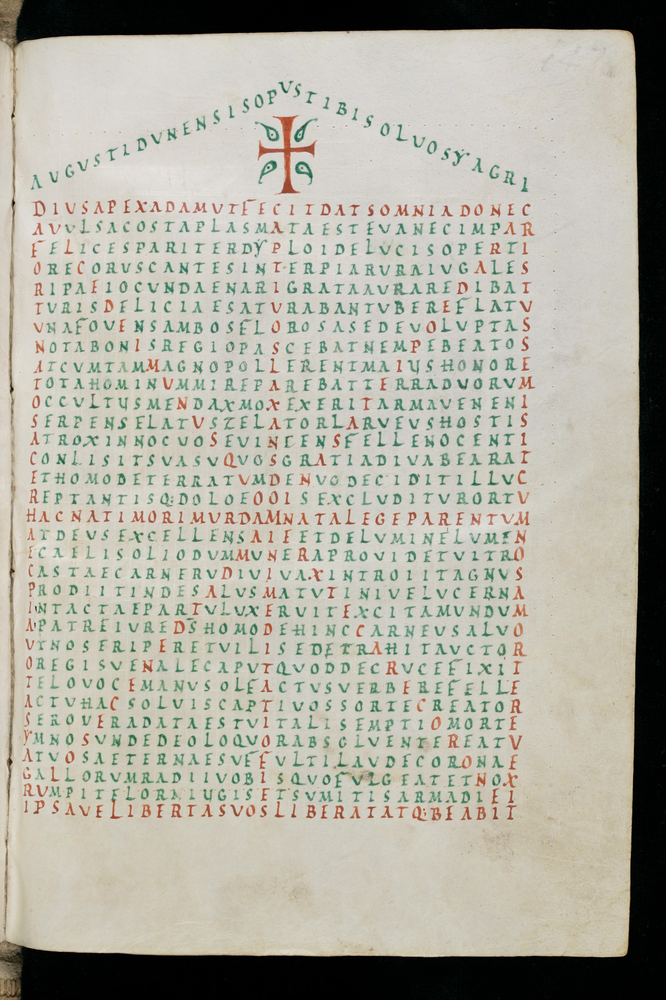|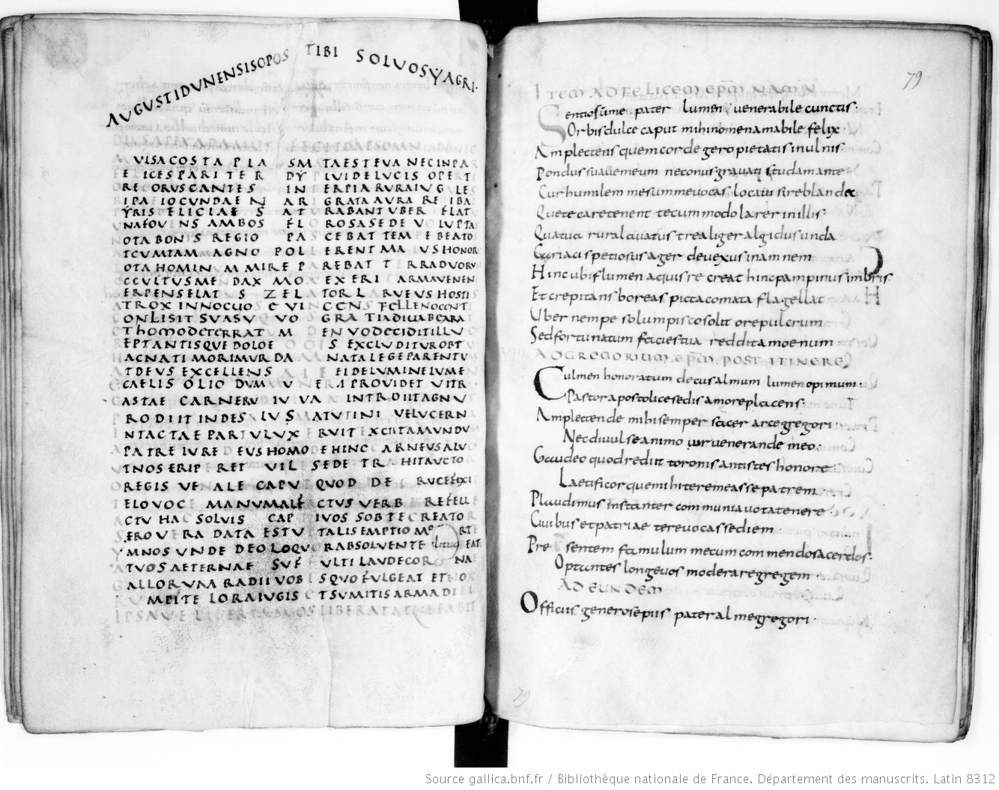|
| --- | ----------- |
Sangallensis 196, IXe s.|Parisinus lat. 8312, Xe s.

---
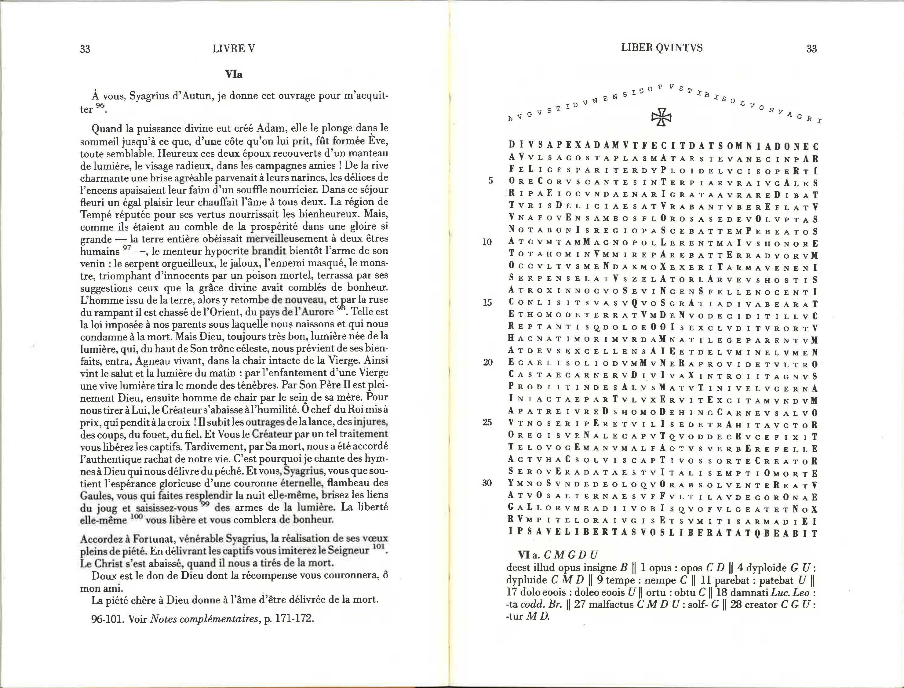 Édition des Belles-Lettres

--- 
## Au-delà de l'Antiquité et du Moyen Âge

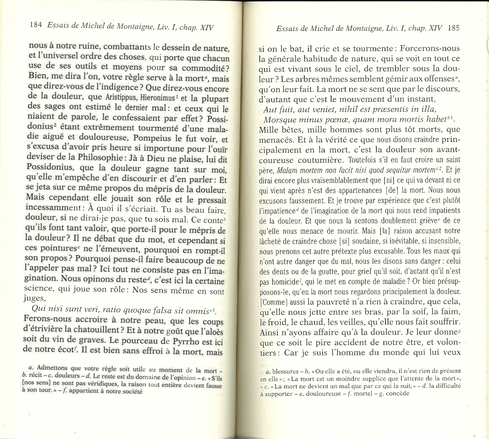 

---

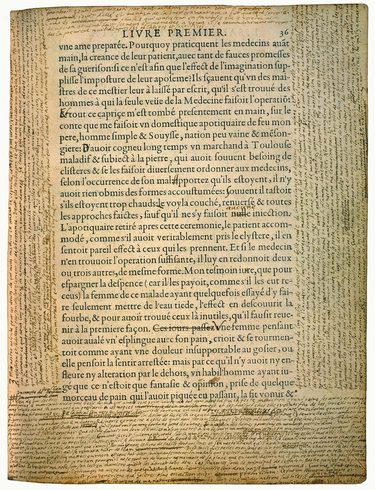 Bibliothèque de Bordeaux, S 1238 Rés. coffre, f. 36. 

---
## Un prototype d'édition de manuscrit moderne

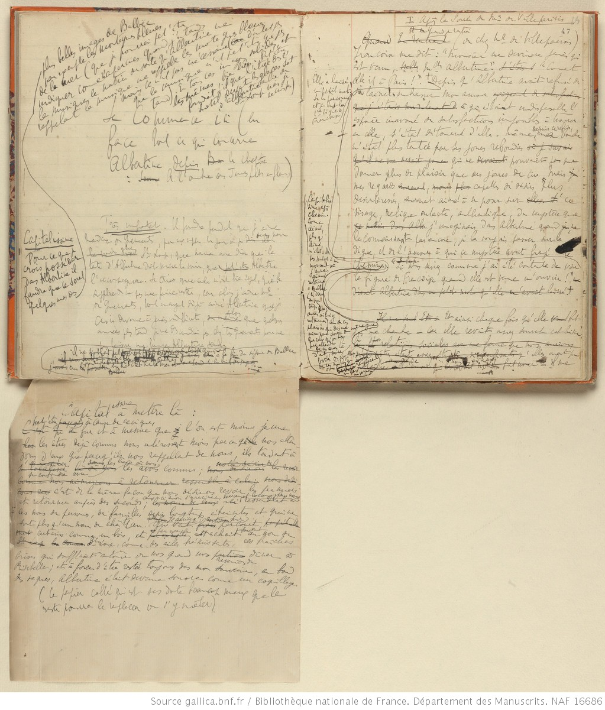 BnF, NAF, 16686, f. 46v-46A-47r

---
  

---
## Des éditions numériques de lettre

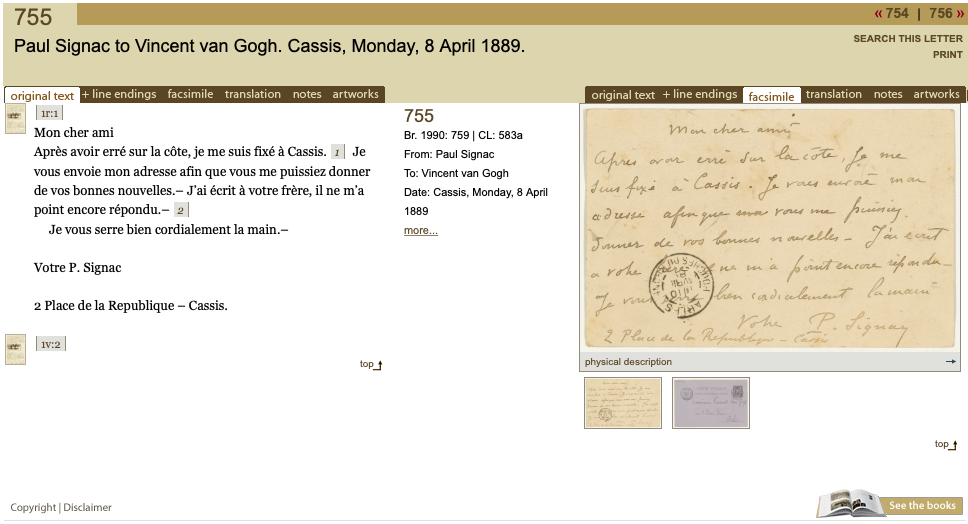

---

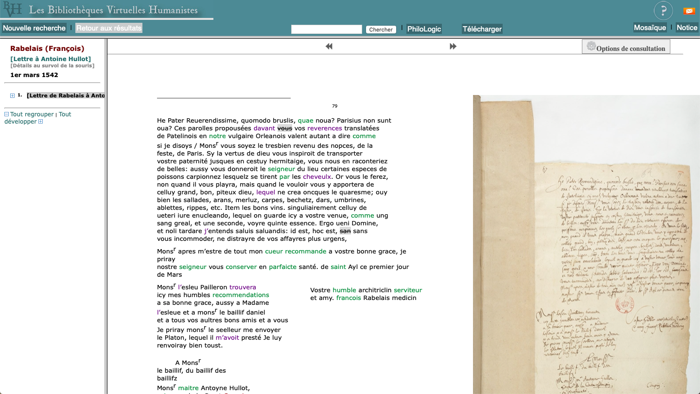


--- 
## Un standard pour l'édition de texte numérique: la TEI

> Son but [à la TEI] est de fournir des recommandations pour la création et la gestion sous forme numérique de tout type de données créées et utilisées par les chercheurs en sciences humaines, comme les sources historiques, les manuscrits, les documents d’archives, les inscriptions anciennes et bien d’autres.
–– Burnard, 2015: 1.

- Focalisation sur le sens du document plutôt que son son apparence
- Langage indépendant de tout logiciel
- Projet né, porté et développé par des scientifiques

---
# Bibliographie

André, Julie et Pierazzo,Elena, « Le codage en TEI des brouillons de Proust : vers l’édition numérique », _Genesis_, 36, 2013,  DOI : 10.4000/genesis.1159, URL: http:// journals.openedition.org/genesis/1159

Burnard, L., _Qu’est-ce que la Text Encoding Initiative?_ Marseille: OpenEdition Press, 2015, DOI: 10.4000/books.oep.1297

Levin, Saul, "Le chameau et le trou de l'aiguille : καμηλος ου κάμιλος ?", _L'Information Grammaticale_, 51, 1991. p. 35-38, DOI : 10.3406/igram.1991.3236, URL: http://www.persee.fr/doc/igram_0222-9838_1991_num_51_1_3236.

---

Römer, Thomas, “Les Cornes de Moïse. Faire entrer la Bible dans l’histoire : Leçon inaugurale prononcée le 5 février 2009” in: Römer, Thomas, _Les cornes de Moïse. Faire entrer la Bible dans l’histoire_, Paris: Collège de France, 2009, URL: http://books.openedition.org/cdf/163.

Trotter, David (éd.), _Manuel de la philologie de l'édition_, Berlin/Boston: De Gruyter, 2015.