Université de Neuchâtel
Master en littérature

# TG: Édition de texte (numérique)
## Cours 2: méthode philologique

Élodie Paupe 
chaire de philologie classique et d'histoire ancienne

28 septembre 2020

---
# Exercice 
Éditer un texte à partir de plusieurs manuscrits. 
Paulin de Nole, _Carmina_, _Ad Jovium_ 

---
## Étape 1: heuristique

> **phase heuristique**: recherche des témoins d'un texte
* Repérage de tous les témoins existants d'un texte
* Collecte des informations sur les témoins perdus
* Information sur la diffusion  et l'utilisation du texte

> **témoin**: tout document qui transmet un texte, partiellement ou dans son intégralité, considéré comme un jalon de la transmission et la transformation du texte.
* Il existe des témoins "physiques", mais également des témoins disparus dont l'éditeur postule l'existence.
* Pour les textes imprimés, une édition fait office de témoin.

--- 
**Pour notre exercice (liste non exhaustive):**

N Paris, Bibliothèque nationale de France, lat. 7558, Lyon, IXe siècle
* [Ad Iovum f. 114v](https://gallica.bnf.fr/ark:/12148/btv1b8585599x/f236.image)

J London, The British Library, Harley, 4831, Saint-Denis, Xe siècle
* [Ad Iovum f. 131r](http://access.bl.uk/item/viewer/ark:/81055/vdc_100056057046.0x000001#?c=0&m=0&s=0&cv=0&xywh=-592%2C-356%2C6008%2C7104)

M München, Bayerische Staatsbibliothek, lat. 26303*, Cluny, milieu du XIIe siècle
* [Ad Iovum f. 174v](https://daten.digitale-sammlungen.de/~db/0008/bsb00082363/images/)

B Bruxelles, Bibliothèque royale de Belgique, 10615-10729, Trêve, env. 1150
* [Ad Iovium f. 138r](https://uurl.kbr.be/1785141)

K Paris, Bibliothèque nationale de France, lat. 9548, Italie du Nord, env. 1450-1460
* [Ad Iovum f.113v](https://gallica.bnf.fr/ark:/12148/btv1b100371312)

---
## Étape 2: collation des manuscrits

> **collation**: 1. comparaison de deux témoins ou plus; 2. résultat de l'action précédente, liste de leçons alternatives par rapport à un témoin choisi comme base ou exemplaire de collation

> **leçon**: ce qu'on lit dans un témoin à un lieu donné. Lorsque l'on compare des leçons, "leçon" est alors synonyme de "variante".

[Cahier de collation numérique](https://docs.google.com/spreadsheets/d/1PDzp1C8HOcF-yptvpnz2XFk647N_ky6UozA4SdcO5vA/edit?usp=sharing)

---
## Étape 3: choisir parmi les variantes

> **variante**: leçon divergente par rapport aux autres

---
* Constitution du stemma
* Valorisation de la _lectio difficilior_

    > **_lectio difficilior_**: leçon  plus difficile à comprendre. Pour trancher entre plusieurs leçons également acceptables en l'absence d'argument généalogique, l'éditeur peut s'appuyer sur l'adapte _difficilior lectio potior_ "la leçon la plus difficile est préférable".

* Les variantes peuvent présenter un intérêt philologique d'ordre linguistique, historique, social ou anthropologique.

---

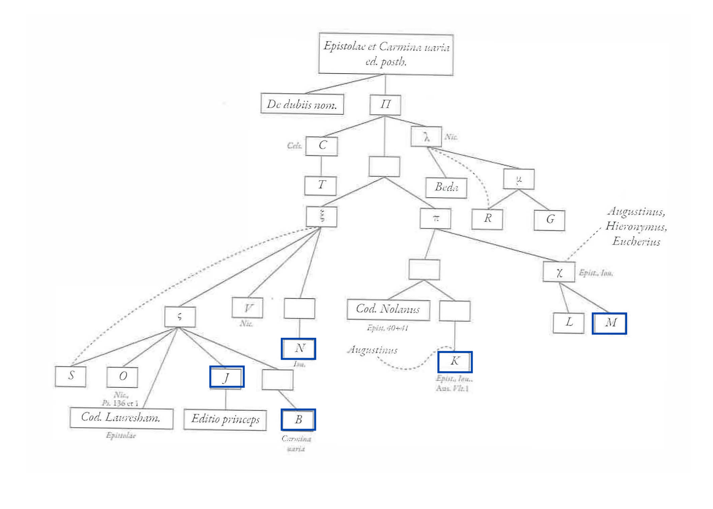
Fig.: Stemma des écrits de Paulin de Nole

---
## Étape 4: rédiger l'apparat critique

> **apparat critique**: relevé de variantes inclus dans l'édition.
* Objectif: donner au lecteur la possibilité de considérer les variantes d'un mot et de comprendre le choix de l'éditeur
* Apparat positif = donne la leçon de chaque manuscrit
* Apparat négatif = donne les variantes de la leçon retenue
* Pour la littérature moderne, l'apparat critique permet généralement de lire le texte "en diachronie" en en présentant des états antérieurs. 

---
Forme générale de l'apparat critique: 

- **lemme** = leçon choisie _liste des manuscrits concernés_ **variantes** ou **conjectures** _liste des manuscrits/éditions concernés_  

    > **lemme**: mot ou séquence de mots choisis comme forme de référence.
    > **conjecture**: 1. reconstruction hypothétique d'une leçon corrompue en un lieu où la tradition n'offre aucune leçon possiblement authentique; 2. correction qui résulte de 1.
    > **emendatio** ou **émendation**: correction d'un texte soit à l'aide des manuscrits soit par conjecture (2e sens plus courant aujourd'hui).

 - **lemme** ] énumération des **variantes** avec _ms_

---
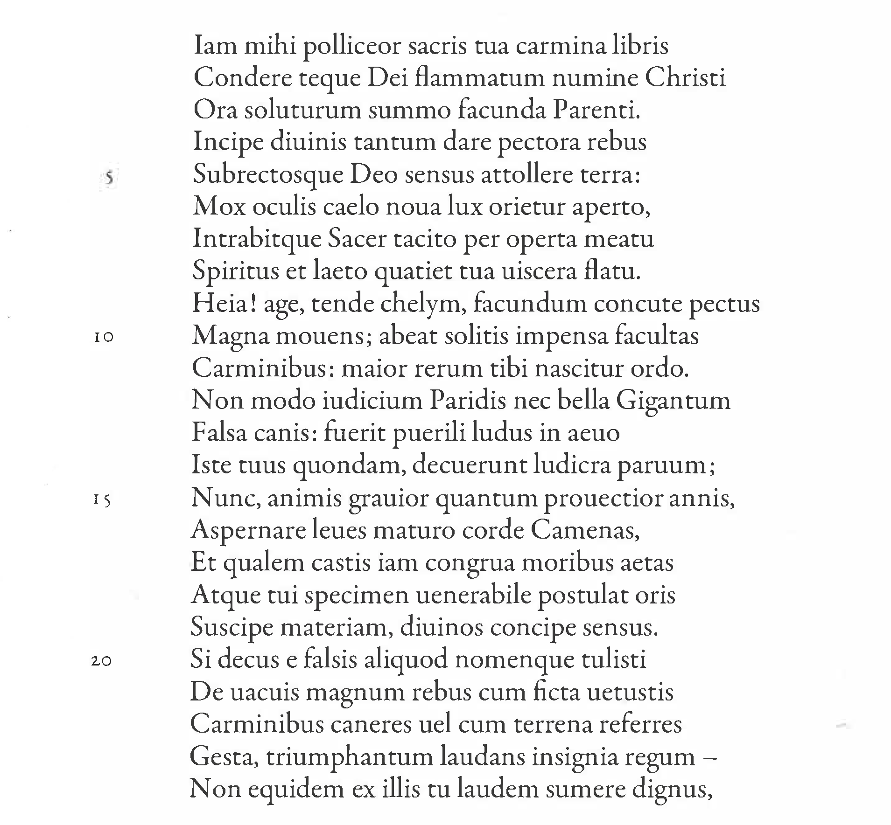 lemme ] variantes _ms_

---

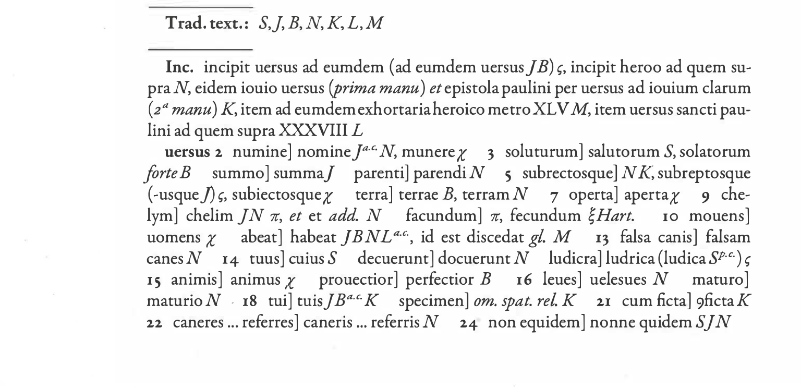
_Paulini Nolani Carmina_, Franz Dolveck (éd.), Turnhout: Brepols, Corpus Christianorum, Series Latina XXI, 2015.

---

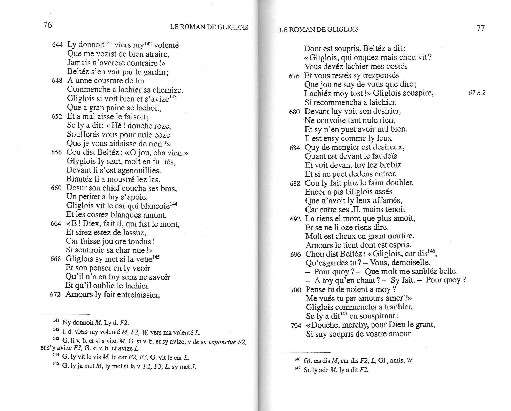 
_Le Roman de Gliglois_, Marie-Luce Chênerie (éd.), Paris: Honoré Champion, 2003.

---

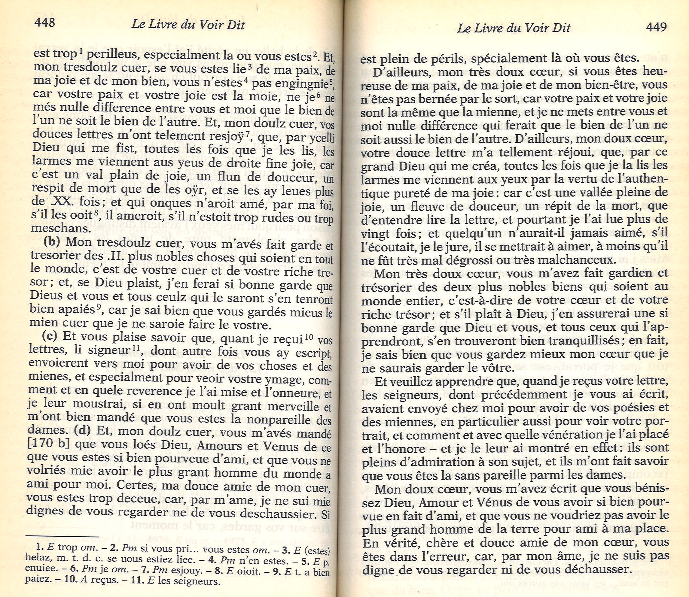 
Guillaume de Machaut, _Le Livre du voir dit_, Paul Imbs (éd.), Paris: Le Livre de poche, 1999.

---

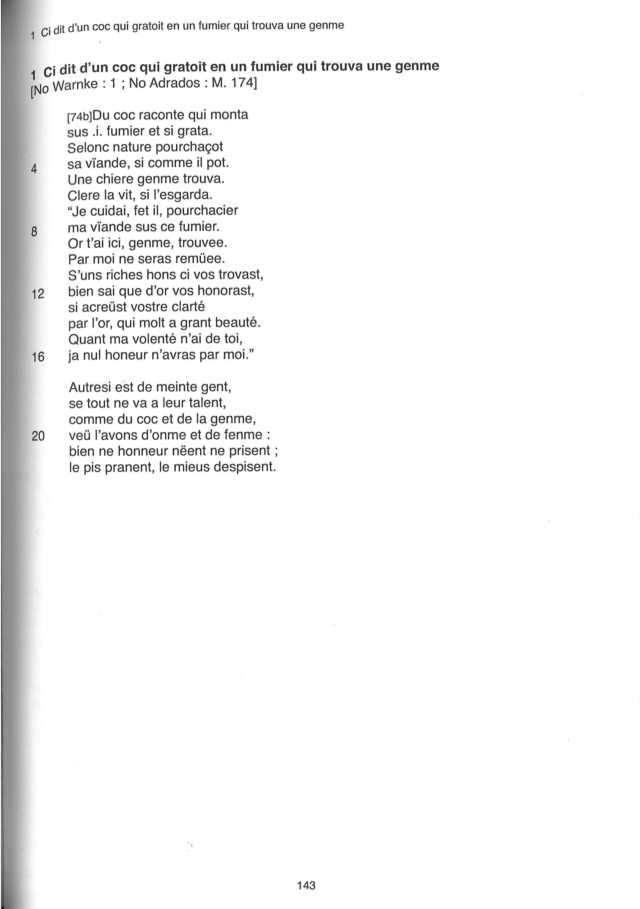 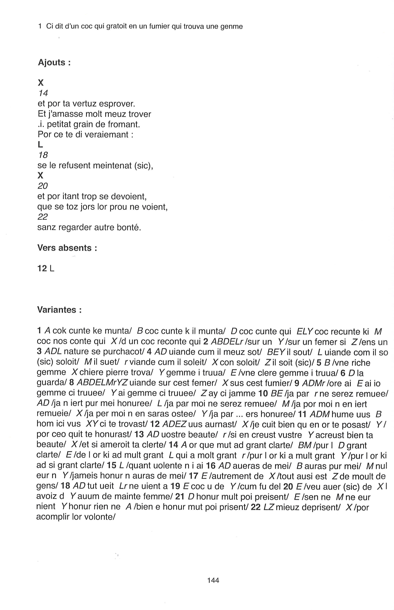
_Isopet dit "de Marie de France"_, Mohan Halgrain (éd.), Neuchâtel, 2013

---

# Deux courants d'éditions philologiques

---

## Méthode généalogique ou lachmanienne

- Élaborée en Allemagne au XIXe siècle par Karl Lachmann
- Pas d'enseignement, mais une doctrine présentée dans l'introduction de son édition de Lucrèce
- Principes de base: 
    - un archétype, puis des copies qui peuvent être organisées par filiation en raison de variations communes (variantes textuelles, coquilles, organisation du texte, lacunes, etc.)
    - Texte reconstruit à partir de la _recensio_ selon des critères objectifs
    - Utilisation de la méthode stemmatique, fondement de la méthode reconstructive, mais valable même lorsqu'un stemma ne peut pas être établi
- Méthode développée ensuite par d'autres chercheurs (théorie de la faute commune, etc.)

--- 

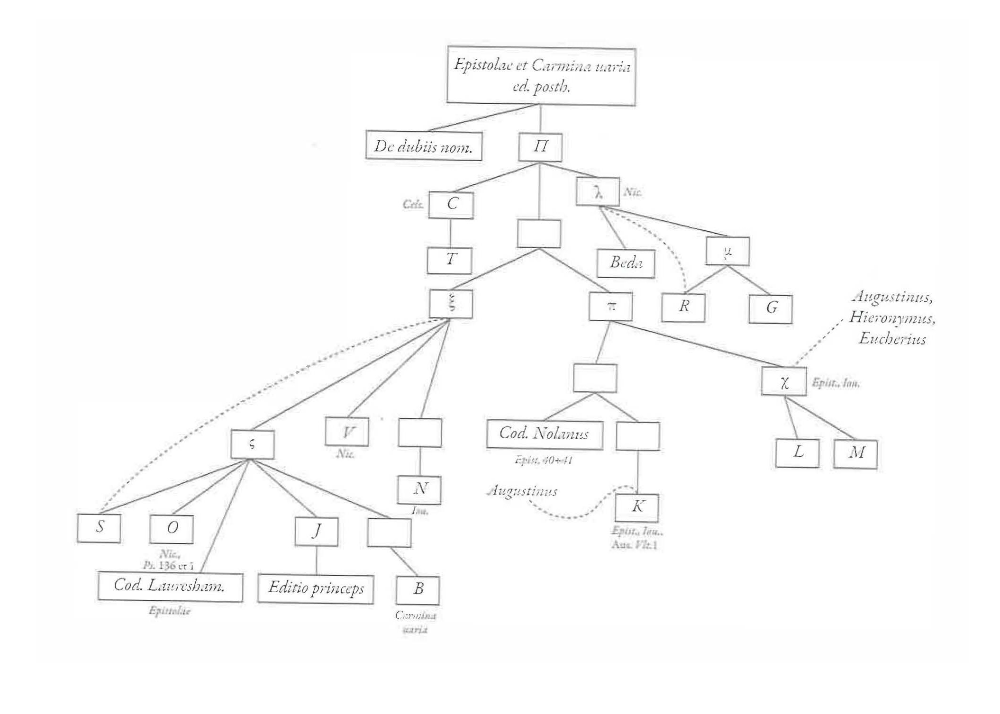
Fig.: Stemma des écrits de Paulin de Nole

--- 
La méthode "de Lachmann" distingue: 
> **_recensio_**: 1. examen de la tradition consistant en l'évaluation des témoins d'un texte donné, à travers l'analyse de leur rapport réciproque et le classement raisonné de leurs variantes; 2.reconstruction d'un texte, par classement raisonné des variantes, sous la forme du plus ancien état de la tradition qui soit perceptible à travers les leçons des témoins subsistants en s'appuyant sur la critique externe et interne

> **_constitutio textus_**: établissement du texte, autrement dit formulation d'une hypothèse de texte conforme le plus possible à l'original sur la base des résultats de la _recensio_.

---
- D'abord appliquée aux textes de l'Antiquité classique, puis aux textes romans
- Critiques des médiévistes: 
    - un degré de fixation différent (les copistes "adaptent" le texte)
    - une durée de transmission moins longue et une diffusion dans l'espace qui touchent le travail des copistes (variabilité linguistique, actualisation du texte, contamination, etc.)

---

## Méthode bédiériste

* Élaborée en France par Joseph Bédier au début du XXe siècle en réaction à la méthode lachmanienne.
* Mise en oeuvre en 1913 dans l'édition du _Lai de l'Ombre_ de Jean Renard, puis développée en 1928.
* Critique de la méthode généalogique: 
    * Hypothèses stemmatiques fragiles
    * Des stemmas souvent à deux branches qui nécessitent de s'en remettre au jugement de l'éditeur
    * Méthode reconstructive et l'illusion de la recréation d'un texte perdu
* Proposition: choisir un bon manuscrit et interventionnisme "pragmatique"

---

> Tout comme l'on peut dire qu'il n'existe pas de méthode universelle en ecdotique romane, de la même manière l'on peut dire qu'il n'existe pas d'édition critique définitive. (Carapezza 2015: 32)

---

# Les différents types d'éditions
> **Édition**: 1. action de faire paraître un texte et d'en assurer la diffusion et la distribution aurpès du public, directemetn ou par le truchement d'intermédiaires. 2.a. Ensemble des opérations intellectuelles et matérielles par lesquelles le texte d'une oeuvre est établi. 2.b. Résultat de 2a. 3. Ensemble des exemplaires d'un livre publié en une seule fois.
---

Il y a des éditions... (Duval 2015)
|| | |
| --- | --- | --- |
autorisée |critique | comparative
définitive| de dernière main |diplomatique 
semi-diplomatique | fac-similaire  | électronique 
en facsimilié | génétique | historico-critique
horizontale | hypertextuelle | imitative
interprétative | _ne varietur_ | originale
posthume | princeps | provisoire
de recherche | savante | synoptique
synthétique | _variorum_ | verticale

---

# Édition numérique

---

## Qu'est-ce qu'une édition électronique?

- Édition électronique ≠ édition numérisée
- Édition électronique ou numérique:
    > [...] publiée directement "en ligne", et dotée de spécificités nouvelles liées au support informatique. (Marchello-Nizia, Lavrentiev, Guillot-Barbance 2015: 156)
    > **édition électronique**: édition dont les données sont encodées et accessibles numériquement (Duval 2015)
- Pour l'espace francophone, premières éditions électroniques = textes en ancien français
    - années 90: [Uitti, _Chevalier de la Charette_](http://www.princeton.edu/~lancelot/ss/)
    - années 90: [Robinson, _Canterbury Tales_](https://people.ucalgary.ca/~scriptor/chaucer/rob.html)
    - années 2000: [_Dictionnaire électronique de Chrétien de Troyes_](http://www2.atilf.fr/dect/)
- Peu d'éditions librement acessibles en ligne

---
- Variété de formats: 
    - mise à disposition en ligne d'une "copie" de l'imprimé
    - avec ou sans facsimilé
    - avec ou sans mise à disposition des fichiers sources
    - avec ou sans interactivité
    - avec ou sans affichage simultané
    - avec ou sans glossaire
    - ...
- Des "compléments en ligne" à des versions papier

---

Pourquoi si peu de production?
- Coût humain et financier
- Infrastructure numérique et pérennité
- Encore en manque de reconnaissance/crédibilité d'un point de vue académique
- Pas de consensus sur les normes éditoriales (mise en place de consortiums): une philologie numérique en devenir

➪ Démarrage lent pour l'édition numérique "critique"
➪ Succès des revues numériques

---
## Spécificités/avantages de l'édition numérique 
(Marchello-Nizia, Lavrentiev, Guillot-Barbance 2015: 161-172)

- Aucune limite dans le choix des variantes
- Affichage dynamique qui s'adapte aux besoins du lectorat
- Rigueur méthodologique plus importante
- Possibilité d'envisager des normes communes au-delà des frontières
- Normalisation du format et des technologies pour assurer la pérennité:
    - XML-TEI, un format ouvert doté de recommandations élaborés par un consortium international
    - documenter son travail pour en assurer la compréhension et l'utilisation

---

Parmi les outils plébiscités par la philologie numérique se trouve le XML-TEI qui permet l'édition philologique complexe... 

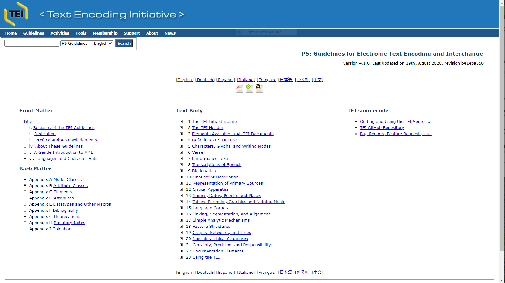 [Guidelines TEI](https://www.tei-c.org/release/doc/tei-p5-doc/en/html/index.html)

... l'analyse computationnelle
... et l'édition

---

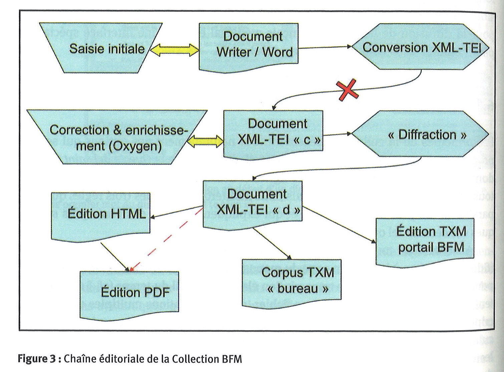
Marchello-Nizia, Lavrentiev, Guillot-Barbance 2015: 172

---

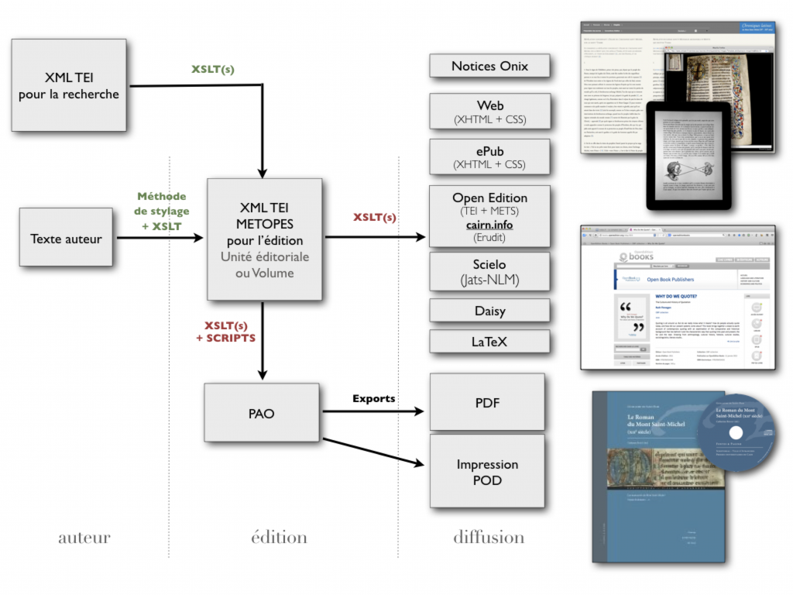
[Projet Metopes](http://www.unicaen.fr/recherche/mrsh/document_numerique/projets/metopes)

---

## _Queste del saint Graal_
|Texte disponible sous différentes formes: | Accès à des informations numériques spécifiques: | 
|:--- |:--- | 
Édition normalisée | Étiquettes morphologiques
Édition diplomatique | Étiquettes morphologiques
Édition facsimilaire  | Parsage syntaxique
Traduction | Encodage du discours direct
Images du manuscrit | Lemmatisation

---

Aperçu de la visualisation synoptique de la _Queste del saint Graal_
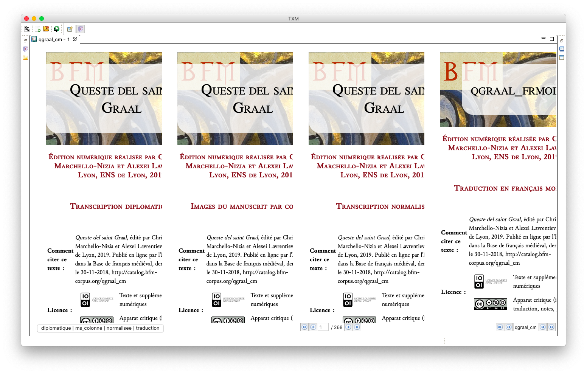

---

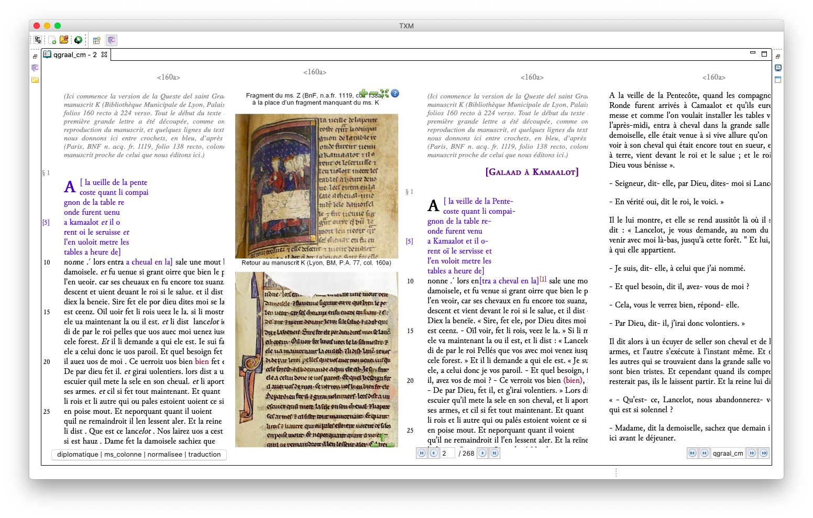

---

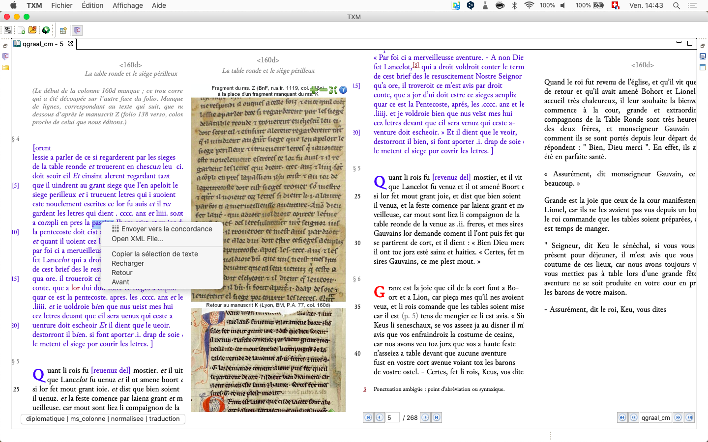

---
# Bibliographie
_Paulini Nolani Carmina_, Franz Dolveck (éd.), Turnhout: Brepols, Corpus Christianorum, Series Latina XXI, 2015.

Bédier, Joseph, _Le Lai de l'Ombre par Jean Renard_, Paris: Firmin-Didot, 1913.

Burnard, Lou, _Qu’est-ce que la Text Encoding Initiative?_ Marseille: OpenEdition Press, 2015, DOI: 10.4000/books.oep.1297

Corbellari, Alain, _Joseph Bédier, écrivain et philologue_, Genève: Droz, "Publication romanes et françaises", n. 220, 1997.

Duval, Frédéric, _Pratiques philologiques en Europe_, Paris: École des chartes, "Études et rencontres de l'École des Chartes", n.21, 2006.

Duval, Frédéric, _Les mots de l'édition de texte_, Paris: École des chartes, "Les manuels de l'École des chartes", 2015.

---

Hamesse, Jacqueline (éd.), _Les problèmes posés par l'édition critique des textes anciens et médiévaux_, Louvain-La-Neuve: Université Catholique de Louvain Publications de l'institut d'études médiévales, 1992.

Hummel, Pascale, _Philologus auctor. Le philologue et son oeuvre_, Berne, Berlin, etc.: Peter Lang, "Sapheneia", n.8, 2003.

Mass, Paul, _Textkritik_, Leipzig: Teubner, 1927.

Trotter, David (éd.), _Manuel de la philologie de l'édition_, Berlin/Boston: De Gruyter, 2015.
- Francesco Carapezza, "Entre théorie et pratique en ecdotique galloromane", 21-43.
- Christiane Marchello-Nizia, Alexey Lavrentiev et Céline Guillot-Barbance, "Édition électronique de la _Queste del saint Graal_", 155-176.
- Claude Buridant, "Édition et traduction", 319-368.
