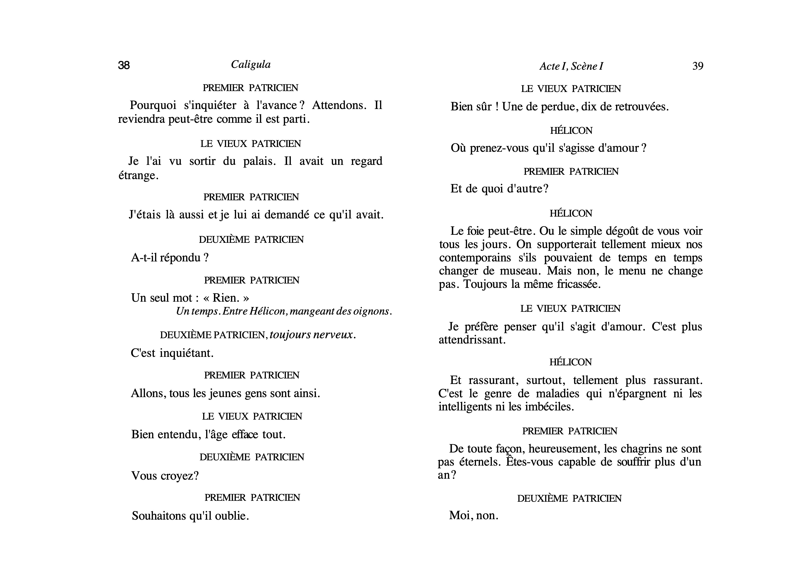

Université de Neuchâtel
Master en littérature

# TG: Édition de texte (numérique)
## Cours 4: texte (prose et poésie)

Élodie Paupe 
chaire de philologie classique et d'histoire ancienne

12 octobre 2020

---
 
# Rappel

--- 

La semaine dernière, nous avons découvert les balises XML-TEI suivantes: 
* `l` 
* `lg` 
* `head` 
* `div` 
* `pb`
* `@type`
* `@n`

1. À quoi correspondent-elles?
1. La modélisation

--- 

# Livre

--- 


---

Considérons la table des matières suivante, à partir des éléments que vous connaissez déjà, quel encodage proposeriez-vous pour l'ouvrage?


---
```XML
<div type="livre">
    <head>Liturgie et société au Moyen Âge</head>
    <div type="avantpropos">
    </div>
    <div type="introduction">
    </div>
    <div type="chapitre" n="1">
        <head>Chapitre 1. La messe dans la société médiévale</head>
        <div type="souschapitre" n="1">
            <head>Le "mythe des origines" et l'eucharistie</head>
        </div>
        <div type="souschapitre" n="2">
            <head>Les rites de la messe au Moyen Âge</head>
        </div>
        <div type="souschapitre" n="3">
            <head>L'efficacité de la langue liturgique</head>
        </div>
        <div type="souschapitre" n="4">
            <head>La symbolique sociale de l'eucharistie</head>
        </div>
    </div>
    <div type="chapitre" n="2">
        <head>Chapitre 2. La liturgie des sacrements</head>
        <div type="souschapitre" n="1">
            <head>Les rites de l'Initiation chrétienne au Moyen Âge</head>
        </div>
        <div type="souschapitre" n="2">
            <head>Le mariage: entre rite social et rite liturgique</head>
        </div>
        <div type="souschapitre" n="3">
            <head>Les ordinations</head>
        </div>
    </div>
    ...
</div>
```
--- 

Et pour celui-ci?


---
```XML
<div type="pièce">
<head>Cyrano de Bergerac</head>
  <div type="acte">
    <head>Acte I</head>
  </div>
  <div type="acte">
    <head>Acte II</head>
  </div>
  <div type="acte">
    <head>Acte III</head>
  </div>
  <div type="acte">
    <head>Acte IV</head>
  </div>
    <div type="acte">
    <head>Acte V</head>
  </div>
</div>
```
Et comme vous êtes experts...

---

```XML
<div type="pièce">
<head>Cyrano de Bergerac</head>
  <div type="acte">
    <head>Acte I</head>
    <div type="scène">
      <head>Scène 1</head>
    </div>
    <div type="scène">
      <head>Scène 2</head>
    </div>
    ...
  </div>
  <div type="acte">
    <head>Acte II</head>
  </div>
  ...
</div>
```

---
Et pour [_Les Fleurs du Mal_](https://fr.wikisource.org/wiki/Les_Fleurs_du_mal/1861)?


---
```XML
<div type="recueil">
    <head>Les Fleurs du mal</head>
    <div type="lettre">
        <head>Au lecteur</head>
    </div>
    <div type="section" n="1">
        <head>Spleen et Idéal</head>
        <div type="poème" n="1">
            <head>Bénédiction</head>
        </div>
        <div type="poème" n="3">
            <head>L'Albatros</head>
        </div>
        <div type="poème" n="1">
            <head>Élévation</head>
        </div>
        ...
    </div>
    <div type="section" n="2">
        <head>Tableaux parisiens</head>
        <div type="poème" n="86">
            <head>Paysage</head>
        </div>
        <div type="poème" n="87">
            <head>Le Soleil</head>
        </div>
        <div type="poème" n="88">
            <head>À une mandiante rousse</head>
        </div>
        ...
    </div>
    <div type="section" n="3">
        <head>Le vin</head>
        <div type="poème" n="104">
            <head>L'Âme du vin</head>
        </div>
        <div type="poème" n="105">
            <head>Le Vin des chiffonniers</head>
        </div>
        <div type="poème" n="106">
            <head>Le Vin de l'assassin</head>
        </div>
        ...
    </div>
    ...
</div>
```
---

# Le texte en prose

---
## Quelques bases
Augmentons la granularité.

---
### Paragraphe `p`
```XML
<head>Zum Schäkespears Tag.</head>
<div>
    <p>
        Mir kommt vor, das sey die edelste von unsern Empfindungen, 
        die Hoffnung, auch dann zu bleiben, 
        wenn das Schicksaal uns zur allgemeinen Nonexistenz zurückgeführt zu haben scheint. 
        Dieses Leben, meine Herren, ist für unsre Seele viel zu kurz, Zeuge, 
        dass ieder Mensch, der geringste wie der höchste, der unfähigste wie der würdigste, eher alles müd wird, als zu leben;
        und dass keiner sein Ziel erreicht, wornach er so sehnlich ausging 
        – denn wenn es einem auf seinem Gange auch noch so lang glückt, fällt er doch endlich, 
        und offt im Angesicht des gehofften Zwecks, in eine Grube, die ihm, Gott weis wer, gegraben hat, und wird für nichts gerechnet.
    </p>
    <p>
        Für nichts gerechnet! Ich! Da ich mir alles binn, da ich alles nur durch mich kenne! So ruft ieder, 
        der sich fühlt, und macht grosse Schritte durch dieses Leben, eine Bereitung für den unendlichen Weeg drüben. Freylich ieder nach seinem Maas. 
        Macht der eine mit dem stärcksten Wandertrab sich auf, so hat der andre siebenmeilen Stiefel an, überschreitet ihn, 
        und zwey Schritte des letzten bezeichnen die Tagreise des ersten. 
        Dem sey wie ihm wolle, dieser embsige Wandrer bleibt unser Freund und unser Geselle, 
        wenn wir die gigantischen Schritte ienes, anstaunen und ehren, seinen Fustapfen folgen, seine Schritte mit den unsrigen abmessen.
    </p>
</div>
```
---
### Saut de page `pb`

 

---

```XML
<div type="nouvelle">
    <head>SANTÉ-PALACE</head>
    <div type="chapitre" n="1">
        <milestone unit="column" n="5A"/>
        <head>I</head>
        <p>
            Ce fut dans le monde entier une explo-<lb/>
            sion de rires. Certes, la capture d'Arsène <lb/>
            Lupin produisit une grosse sensation, <lb/>
            et le public ne marchanda pas à la police <lb/>
            les éloges qu'elle méritait pour cette re-<lb/>
            <milestone unti="column" n="5B"/>
            vanche si longtemps espérée et si pleine- <lb/>
            ment obtenue. Le grand aventuer était <lb/>
            pris. L'extraordinaire, le génial, l'invisible <lb/>
            héros, se morfondait, comme les autres <lb/>
            entre les quatre murs d'une cellule de la <lb/>
            prison de la Santé, écraés à son tour par <lb/>
            cette puissance formidable qui s'appelle <lb/>
            <pb/>
            <milestone unit="column" n="6A"/>
            la Justice et qui, tôt ou tard, fatalement <lb/>
            brise les obstacles qu'on lui oppose et <lb/>
            détruit l'oeuvre de ses adveraires.
        </p>
        <p> 
            Toute cela fut dit, imprimé, répété com- <lb/>
            menté, rabâché. Le Préfêt de police eut <lb/>
            la croix de Commandeur, M. Weber, la <lb/>
            croix d'Officier. On exalta l'adresse et <lb/>
            le courage de leurs plus modestes colla- <lb/>
            borateurs. On appluadit. On chanta vic-<lb/>
            toire. On fit des articles et des discours.
        </p>
    </div>
</div>
```

---

Exercice 1: disponible [ici](https://github.com/elodiepaupe/UNINE_edition-numerique/blob/master/Cours%204/exercices/cours4_exercices.mdwn)

---
## Théâtre
[TEI Guidelines de théâtre](https://www.tei-c.org/release/doc/tei-p5-doc/en/html/DR.html)

---
Que veut-on encoder à des fins d'édition?

---


---


---
Les informations telles que la liste des personnages, les indications liminaires qui portent sur la mise en scène ou celles relatives à la première figure dans le `font`ou le `back`du document XML-TEI. 

---


--- 



---
### Tour de parole `sp`

```XML
<sp>
    PREMIER PATRICIEN
    Pourquoi s'inquiéter à l'avance ? Attendons. Il reviendra peut-être comme il est parti.
</sp>

<sp>
    LE VIEUX PATRICIEN
    Je l'ai vu sortir du palais. Il avait un regard étrange.
</sp>

<sp>
    PREMIER PATRICIEN
    J'étais là aussi et je lui ai demandé ce qu'il avait.
</sp>

<sp>
    DEUXIÈME PATRICIEN
    A-t-il répondu ?
</sp>

<sp>
    PREMIER PATRICIEN
    Un seul mot : « Rien. »
</sp>
```

---
### Personnage qui parle `speaker`
```XML
<sp who="patricien1">
    <speaker>PREMIER PATRICIEN</speaker>
    <p>Pourquoi s'inquiéter à l'avance ? Attendons. Il reviendra peut-être comme il est parti.</p>
</sp>

<sp who="vieuxpatricien">
    <speaker>LE VIEUX PATRICIEN</speaker>
    <p>Je l'ai vu sortir du palais. Il avait un regard étrange.</p>
</sp>

<sp who="patricien1">
    <speaker>PREMIER PATRICIEN</speaker>
    <p>J'étais là aussi et je lui ai demandé ce qu'il avait.</p>
</sp>

<sp who="patricien2">
    <speaker>DEUXIÈME PATRICIEN</speaker>
    <p>A-t-il répondu ?</p>
</sp>

<sp who="patricien1">
    <speaker>PREMIER PATRICIEN</speaker>
    <p>Un seul mot : « Rien. »</p>
</sp>
```

--- 
### Didascalie `stage`

```XML
<sp who="patricien1">
    <speaker>PREMIER PATRICIEN</speaker>
    <p>Pourquoi s'inquiéter à l'avance ? Attendons. Il reviendra peut-être comme il est parti.</p>
</sp>

<sp who="vieuxpatricien">
    <speaker>LE VIEUX PATRICIEN</speaker>
    <p>Je l'ai vu sortir du palais. Il avait un regard étrange.</p>
</sp>

<sp who="patricien1">
    <speaker>PREMIER PATRICIEN</speaker>
    <p>J'étais là aussi et je lui ai demandé ce qu'il avait.</p>
</sp>

<sp who="patricien2">
    <speaker>DEUXIÈME PATRICIEN</speaker>
    <p>A-t-il répondu ?</p>
</sp>

<sp who="patricien1">
    <speaker>PREMIER PATRICIEN</speaker>
    <p>Un seul mot : « Rien. »</p>
</sp>

<stage>Un temps. Entre Hélicon, mangeant des oignons.</stage>
```
--- 

Exercice 2: [ici](https://github.com/elodiepaupe/UNINE_edition-numerique/blob/master/Cours%204/exercices/cours4_exercices.mdwn)

---

# Texte en vers
[Guidelines TEI pour la versification](https://www.tei-c.org/release/doc/tei-p5-doc/en/html/VE.html)

--- 

## Quelques bases

---
### Strophe/groupe de vers `lg` et vers `l`

```XML
<head>Mon rêve familier</head>  
    <lg n="1" type="quatrain">
        <l type="alexandrin">Je fais souvent ce rêve étrange et pénétrant</l>
        <l type="alexandrin">D'une femme inconnue, et que j'aime, et qui m'aime</l>
        <l type="alexandrin">Et qui n'est, chaque fois, ni tout à fait la même</l>
        <l type="alexandrin">Ni tout à fait une autre, et m'aime et me comprend.</l>
    </lg>
```

--- 

_Le temps a laissé son manteau
De vent, de froidure et de pluie,_
Et s'est vêtu de broderie,
De soleil luisant, clair et beau.

Il n'y a bête ni oiseau,
Qu'en son jargon ne chante ou crie :
_Le temps a laissé son manteau
De vent, de froidure et de pluie._

Rivière, fontaine et ruisseau
Portent en livrée jolie,
Gouttes d'argent, d'orfèvrerie,
Chacun s'habille de nouveau
_Le temps a laissé son manteau
De vent, de froidure et de pluie._

--- 

```XML
<lg type="quatrain">
    <lg type="refrain">
        <l>Le temps a laissé son manteau</l>
        <l>De vent, de froidure et de pluie,</l>
    </lg>
    <l>Et s'est vêtu de broderie,</l>
    <l>De soleil luisant, clair et beau.</l>
</lg>

<lg type="quatrain">
    <l>Il n'y a bête ni oiseau,</l>
    <l>Qu'en son jargon ne chante ou crie :</l>
    <lg type="refrain">
        <l>Le temps a laissé son manteau</l>
        <l>De vent, de froidure et de pluie.</l>
    </lg>
</lg>

<lg type="sizain">
    <l>Rivière, fontaine et ruisseau</l>
    <l>Portent en livrée jolie,</l>
    <l>Gouttes d'argent, d'orfèvrerie,</l>
    <l>Chacun s'habille de nouveau</l>
    <lg type="refrain">
        <l>Le temps a laissé son manteau</l>
        <l>De vent, de froidure et de pluie.</l>
    </lg>
</lg>
```
--- 
### Saut de vers `lb`


```XML
<lg>
  <l type="alexandrin">Ceulx qui sont mesdisans, se plairont à mesdire,</l>
  <l type="alexandrin">Ceulx  qui sont moins fascheux, diront des mots pour <lb/>[rire,</l>
  <l type="alexandrin">Ceulx qui sont plus vaillans, vanteront leur valeur:</l>
</lg>
```

---
### Rime 
Des solutions différentes: encoder un mot ou encoder une rime.

```XML
<lg n="1" type="quatrain" ryhme="abba">
  <l type="alexandrin">Je fais souvent ce rêve étrange et <w rhyme="a">pénétrant</w></l>
  <l type="alexandrin">D'une femme inconnue, et que j'aime, et qui m'<w rhyme="b">aime</w></l>
  <l type="alexandrin">Et qui n'est, chaque fois, ni tout à fait la <w rhyme="b">même</w></l>
  <l type="alexandrin">Ni tout à fait une autre, et m'aime et me <w rhyme="a">comprend</w>.</l>
</lg>
```

```XML
<lg n="1" type="quatrain" ryhme="abba">
  <l type="alexandrin">Je fais souvent ce rêve étrange et <rhyme label="a">pénétrant</rhyme></l>
  <l type="alexandrin">D'une femme inconnue, et que j'aime, et qui m'<rhyme label="b">aime</rhyme></l>
  <l type="alexandrin">Et qui n'est, chaque fois, ni tout à fait la <rhyme label="b">même</rhyme></l>
  <l type="alexandrin">Ni tout à fait une autre, et m'aime et me <rhyme label="a">comprend</rhyme>.</l>
</lg>
```
---
### Césure `caesura`
Utilisé en balise autofermante. 

```XML
<l>In a somer seson,<caesura/> whan softe was the sonne, </l>
<l>I shoop me into shroudes <caesura/> as I a sheep were, </l>
<l>In habite as an heremite <caesura/> unholy of werkes, </l>
<l>Went wide in this world <caesura/> wondres to here. </l>
```
--- 

Exercice 3: [ici](https://github.com/elodiepaupe/UNINE_edition-numerique/blob/master/Cours%204/exercices/cours4_exercices.mdwn)

--- 
## Théâtre en vers

--- 
### Antilabe `l`et `@part`
Morcellement d'un vers sur plusieurs répliques. Il est possible de le signaler avec l'attribut `@part` et les valeur `I` (_initial_), `M` (_Middle_) ou `F` (_Final_).

```XML
<sp>
    <speaker>Le portier,</speaker> <stage>le poursuivant.</stage>
    <l part="I">Holà ! vos quinze sols !</l>
</sp>
<sp>
    <speaker>Le cavalier.</speaker>
    <l part="M">J’entre gratis !</l>
</sp>
<sp>
    <speaker>Le portier.</speaker>
    <l part="F">Pourquoi ?</l>
</sp>
<sp>
    <speaker>Le cavalier.</speaker>
    <l>Je suis chevau-léger de la maison du Roi !</l>
</sp>
```

--- 

Exercice 4: [ici](https://github.com/elodiepaupe/UNINE_edition-numerique/blob/master/Cours%204/exercices/cours4_exercices.mdwn)


---
## Bibliographie
Albert Camus, _Caligula_, 1944 [Folio théâtre, 1993].

Johann Wolfgang von Goethe, _Zum Schäkespears Tag_, 1771 [1854], URL: [https://de.wikisource.org/wiki/Zum_Schäkespears_Tag](https://de.wikisource.org/wiki/Zum_Sch%C3%A4kespears_Tag).

William Langland, _Piers Plowman_, 1360-1387.

Maurice Leblanc, _Les trois crimes d'Arsène Lupin_, 1917, URL: [http://catalogue.bnf.fr/ark:/12148/cb35976256p](http://catalogue.bnf.fr/ark:/12148/cb35976256p)

Éric Palazzo, _Liturgie et société au Moyen Âge_, 2000.

Edmond Rostand, _Cyrano de Bergerac_, 1897, URL: [https://fr.wikisource.org/wiki/Cyrano_de_Bergerac_(Rostand)](https://fr.wikisource.org/wiki/Cyrano_de_Bergerac_(Rostand))

--- 
### Bonus: encoder la métrique latine

```XML
<l>
 <seg type="hemistich">
  <seg type="foot">
   <seg type="syll">Ar</seg>
   <seg type="syll">ma </seg>
   <seg type="syll">vi</seg>
  </seg>
  <seg type="foot">
   <seg type="syll">rum</seg>
   <seg type="syll">que </seg>
   <seg type="syll">ca</seg>
  </seg>
  <seg type="foot" part="I">
   <seg type="syll">no </seg>
  </seg>
 </seg>
 <seg type="hemistich">
  <seg type="foot" part="F">
   <seg type="syll">Tro</seg>
  </seg>
  <seg type="foot">
   <seg type="syll">iae </seg>
   <seg type="syll">qui </seg>
  </seg>
 </seg>
</l>
```
--- 
