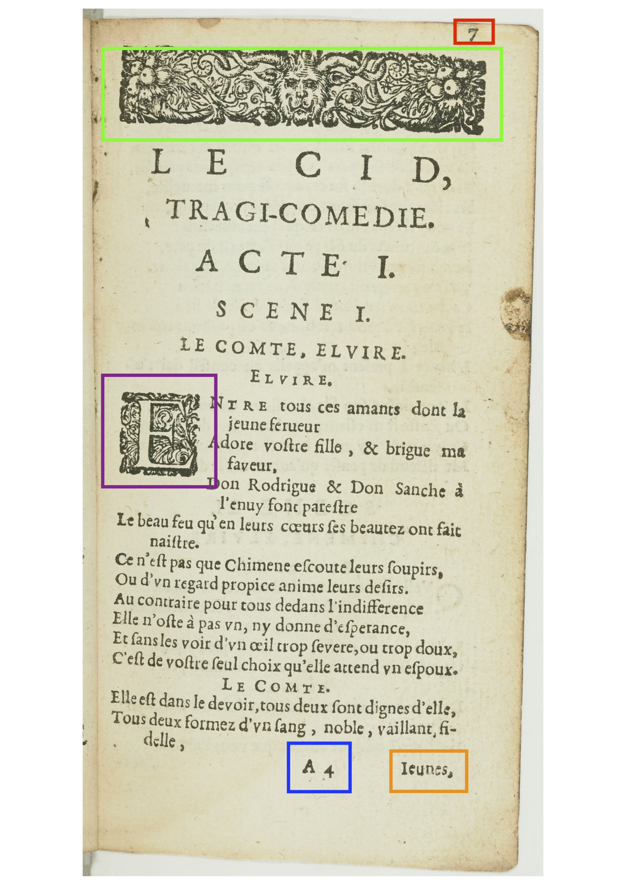
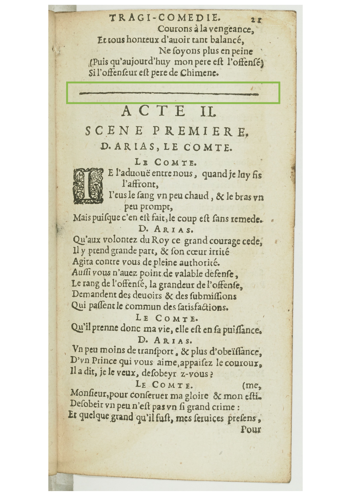
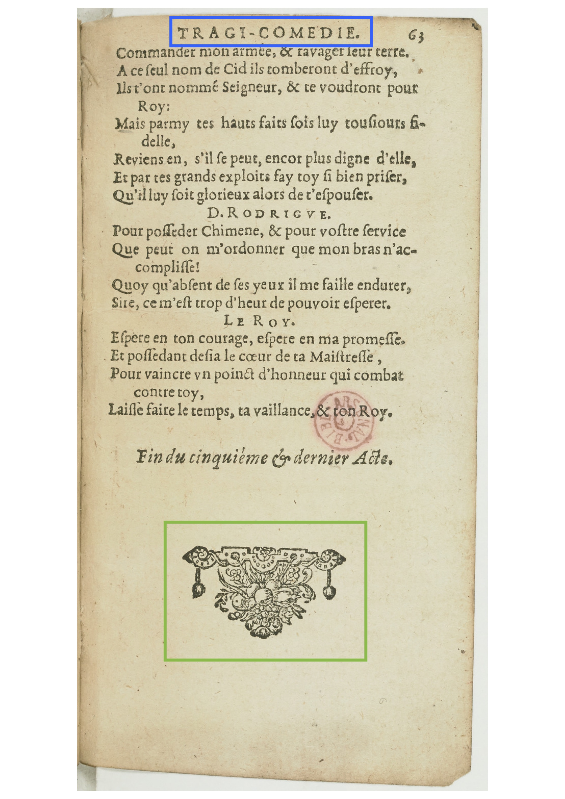

Université de Neuchâtel
Master en littérature

# TG: Édition de texte (numérique)
## Cours 5: annotation et normalisation

Élodie Paupe 
chaire de philologie classique et d'histoire ancienne

19 octobre 2020

---
 
# Intervention éditoriale
[Guidelines TEI. 11. Representation of Primary Sources](https://www.tei-c.org/release/doc/tei-p5-doc/en/html/PH.html#PHSK)

---
## Annoter `<note>`

Pour introduire une note, on le fait à l'endroit où l'on mettrait un appel de note, avec la balise `<note>`

```XML
<sp>
    <speaker>Infante</speaker>
    <l>Ie ne viens pas ici conſoler te douleurs.</l>
    <l>Ie viens pluſtoſt meſler mes ſouspirs à tes pleurs.</l>
        <note>L'infante est secrètement amoureuse de Don Rodrigue.</note>
</sp>
```

---

On peut ajouter l'attribut `@type` pour préciser le type de note, par exemple: 
```XML
<note type="lang">L'accent circonflexe n'a pas encore été introduit.</note>
<note type="litt">L'infante est secrètement amoureuse de Rodrigue.</note>
```

NB: La valeur de l'attribut `@type` n'est pas fixe. Une note lexicale est généralement encodée avec la valeur `gloss`.

---

Si on veut localiser la note dans l'édition (note de fin de page, de fin de document, note marginale), on utilise l'attribut `@place`: 

```XML
<note type="lang" place="foot">L'accent circonflexe n'a pas encore été introduit.</note>
<note type="litt" place="margin">L'infante porte également le nom de Doña Urraque.</note>
<note type="litt" place="end">L'infante est secrètemetn amoureuse de Rodrigue</note>
```

NB: La valeur de l'attribut `@place`n'est pas fixe: on peut donc trouver `foot`, `footnote`, `bottom`, etc.

---

### Attention: ne pas confondre commentaire et annotation

```XML
<!-- Ceci est un commentaire sur l'encodage, ce n'est n'est pas une note sur le contenu.  --> 
<note>Alors que ceci est une note sur d'interprétation à destination du lectorat.</note>
```
---

Exercice 1: [ici]()

---

## Normaliser le texte `orig` et `reg`

Pour normaliser tout en conservant la leçon originale, on emploie les balises `<orig>` et `<reg>` encadrées par une balise `<choice>`.

```XML
<l>
  <orig>Ah Madame! en ce cas je n'ay plus de ſoucy.</orig>
  <reg>Ah Madame! en ce cas je n'ai plus de souci.</reg>
</l>
```

---

On peut aussi opérer au niveau du mot

```XML
Ah Madame! en ce cas je n'
<choice>
  <orig>ay</orig>
  <reg>ao</reg>
</choice>
plus de 
<choice>
  <orig>ſoucy</orig>
  <reg>souci</reg>
</choice>.
```

---

Ou au nivau de la lettre

```XML
Ah Madame! en ce cas je n'a<choice><orig>y</orig><reg>i</reg></choice> 
plus de <choice><orig>ſ</orig><reg>s</reg></choice>ouc<choice><orig>y</orig><reg>i</reg></choice>.
```
---
### Développer l'abréviation `ex`, `abbr` et `expan`

On peut développer les abbréviations:

```XML
flámatú
fla<ex>m</ex>matu<ex>m</ex>
```

En fonction des abréviations ou en cas de perte d'information, on préfèrera employer `<choice>`

```XML
Condere teque dei
<choice>
  <abbr>flámatú</abbr>
  <expan>flammatum</expan>
</choice>
munere Christi
```
---
### Corriger le texte `corr` et `sic` 

Il est possible de corriger le texte. 

```XML
Mon repos m'abandonne; et ma flame revit
Mon repos m'abandonne; et ma flam<corr>m</corr>e revit.
```
---

En fonction de la correction ou en cas de perte d'information, on préfèrera employer `<choice>`

```XML
Mon repos m'abandonne; et ma 
<choice>
    <sic>flame</sic>
    <corr>flamme<corr> 
</choice>
revit.
```
--- 

En cas d'oubli manifeste, on peut toujours rajouter un mot avec `<supplied>`:

```XML
<li>Mon repos m'abandonne; et ma flame revit.</li>
<li>Ce qui va ſeparer Rodrigue <supplied>de</supplied> Chimene,</li>
<li>Avecquemon eſpoir fait renaiſtre ma peine, </li>
<li>Et leur diviſion que je vois à regret, </li>
<li>Dans mon eſprit charmé jette vn plaiſir ſecret.</li>
```
---

Exercice 2: [ici]()

---
### Documenter la normalisation au sens large du terme dans le `teiHeader`

> tout document TEI (représenté au moyen d’un élément `<TEI>`) a au moins deux parties : un en-tête (représenté au moyen d’un élément `<teiHeader>`) contenant des métadonnées décrivant le document, et le texte lui-même (généralement représenté par un élément `<text>`).
–– Burnard 2015: "En-tête et division", §2.

---

```XML
<encodingDesc>
     <editorialDecl>
        <hyphenation>
            <ab>Le texte corrige le découpage en scène à la scène 7, acte 2<ptr target="#A02S07"/>.</ab>                    
            <ab>Les sauts de ligne sont corrigés sans indiquer si le rejet s'effectuait au-dessus ou au-dessous.</ab>
        </hyphenation>
        <correction>
            <ab>Toutes les corrections sont proposées en alternative.</ab>
            <ab>Les majuscules sont conservées.</ab>
        </correction>
        <normalization>
            <ab>La normalisation est proposée en alternative.</ab>
            <ab>Le ſ est normalisé en s sans indication.</ab>
            <ab>I et V sont normalisés en j et u sans indication.</ab>
        </normalization>
    </editorialDecl>
</encodingDesc>

```
--- 

Exercice 3: [ici]()

---

# La mise en page

---
## Analyser la page

* En rouge, le numéro de page
* En vert, le bandeau
* En violet, une lettre initiale ornée
* En bleu, la signature de cahier
* En orange, la réclame

---

* En vert, le couillard (ou couyard) = un filet typographique étroit

---


* En bleu, le titre courant
* En vert, un cul-de-lampe de fleurons

---
## Elément de mise en page `fw`


`<fw>`peut regrouper toutes les informations d'un coup: 
```xml
<fw>7 A4 Jeunes,<fw>
```
ou les distinguer avec `@type` et `@place`:
```xml
<fw type="pageNum" place="top-right">7</fw>
<fw type="sig" place="bottom-center">A4</fw>
<fw type="catch" place="bottom-right">Jeunes,</fw>
```

---

## Mise en évidence `<hi>`

Pour signaler une mise en évidence typographique: gras, italique, majuscules, exposant… 


```xml
<speaker>ELVIRE</speaker>
<l><hi>E</hi><hi>ntre</hi> tous ces amants dont la 
<lb/ break="yes"> jeune ferueur</l>
<l>Adore voſtre fille, &amp; brigue ma
<lb/ break="yes"> faveur,</l>
```

---
## Les attributs

---
### `@place`


`@place` encode la localisation sur la page d'une information. On préfèrera les expressions anglaises.

```xml
<fw type="runningTitle" place="top-centre">TRAGI-COMEDIE</fw>
<fw type="pageNum" place="top-right">21</fw>
<pb/>
  <lg/ break="no" rend="right">Courons à la vengeance,</l>
  <l>Et tous honteux d'avoir tant balancé, 
  <lb/ break="no" rend="right"> Ne soyons plus en peine</l>
  <l>(Puis qu'aujourd'hui mon père est l'offensé)<l/>
  <l>Si l'offenseur est père de Chimène</l>
<figure type="filet"/>
<div type="scene">
    <head place="center">ACTE II.<lb/>Scene premiere.</head>
    <stage place="center">D. ARIAS, Le COMTE</stage>
    <sp who="comte">
        <speaker place="center">Le Comte</speaker>
        <l><hi>I</hi><hi>E</hi> l'aduouë entre nous, 
        quand je luy fis <lb/ break="yes">l'affront,
        ...
    </sp>
...
</div>
```

---
### `@rend`

`@rend` (_rendition_) encode le traitement de la police: `italic`, `bold`, `uppercase`, `strikethrough`, `small-caps`, etc.

```xml
<div type="scene">
    <head place="center" rend="uppercase">ACTE II. <lb/>S<hi rend="small-caps">cene premiere</hi>.</head>
    <stage place="center" rend="uppercase">D. ARIAS, Le COMTE</stage>
    <sp who="comte">
        <speaker place="center" rend="uppercase">L<hi rend="small-caps">e Comte</hi></speaker>
        <l><hi rend="initiale">I</hi><hi rend="small-caps">e</hi> l'aduouë entre nous, 
        quand je luy fis <lb/ break="yes">l'affront,</l>
        ...
    </sp>
...
</div>
```
---

Exercice 4: [ici]()

---
### Sources

Burnard, Lou, _Qu’est-ce que la Text Encoding Initiative?_ [en ligne], Marseille: OpenEdition Press, 2015. Disponible sur Internet : <http://books.openedition.org/oep/1298>. DOI : https://doi.org/10.4000/books.oep.1237.

_Le Cid_, tragi-comédie par Monsieur Corneille, suivant la Copie imprimée à Paris, 1651. URL: [https://gallica.bnf.fr/ark:/12148/bpt6k1280248c](https://gallica.bnf.fr/ark:/12148/bpt6k1280248c)

