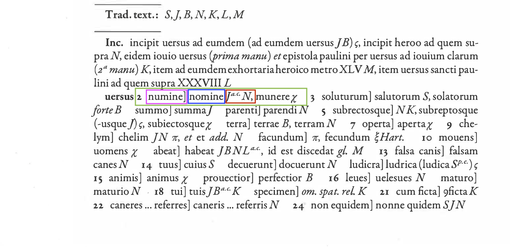
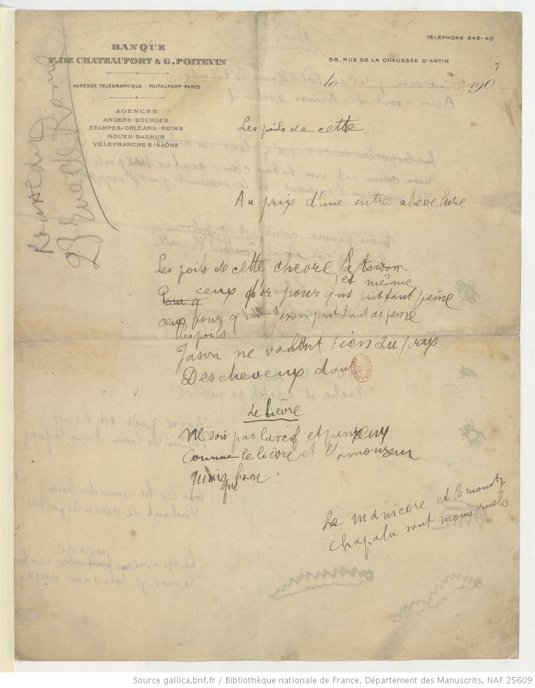

Université de Neuchâtel
Master en littérature

# TG: Édition de texte (numérique)
## Cours 6: annotation critique

Élodie Paupe 
chaire de philologie classique et d'histoire ancienne

26 octobre 2020

---
 
# Apparat critique
[12 Critical Apparatus](https://www.tei-c.org/release/doc/tei-p5-doc/en/html/TC.html#TCAPLK)

---
## Rappel



* En vert, une entrée
* En violet, le lemme = la variante choisie par l'éditeur
* En bleu, une variante
* En rouge, les témoins concernés par une variante

---

## En TEI


```XML
<app>
    <lem>numine</lem>
    <rdg wit="#J #N">nomine</rdg>
    <rdg wit="χ">munere</rdg>
</app>
```
---

## Signaler les `<witness>` ("témoin") d'une édition
Les témoins sont regroupés dans une `<listWit>` placée dans le `<sourceDesc>`. Chacun d'eux est identifié à l'aide d'un `@xml:id`.

Chaque témoin est décrit, notamment à l'aide
* d'un `<bibl>`(_bibliographic citation_)…
* d'un `<mdDesc>` (_manuscript description_)…

```xml
<sourceDesc>
  <lisWit>
    <witness xml:id="msA">  
      <bibl>…</bibl>
    </witness>
    <witness xml:id="msB">
      <msDesc>...</msDesc>
    </witness>
  </lisWit>
</sourceDesc>
```
---

### Appeler un `<witness>`
Lorsqu'on voudra faire appel à un témoin dans notre apparat critique, on pourra l'appeler avec l'attribut `@wit` qui permet de pointer vers un `witness` défini par un `xml:id`: 

```XML
<witness xml:id="test">
...
<app>
    <rdg wit="#test">...</rdg>
</app>
```
NB: la valeur de l'attribut est composée de dièse et de la valeur de l'`@xml:id` vers lequel on pointe.

---

### `<app>` (_apparatus entry_) sert à marquer une entrée d'apparat 

Les différentes leçons sont identifiées à l'aide de la balise `<rdg>` (_reading_).
Si plusieurs leçons peuvent être groupées, on peut les encoder avec `<rdgGrp>`.

```XML
huius seculi banditias euadere posset.
<app>
    <rdgGrp>
        <rdg wit="#AS #Sang">seculi</rdg>
        <rdg wit="#P1">saeculi</rdg>
    </rdgGrp>
    <rdg wit="#MSI">mundi</rdg>
</app>
```

---
### `<lem>` (_lemma_) sert à identifier la leçon retenue par l'éditeur

```XML
huius seculi banditias euadere posset.
<app>
    <lem wit="#AS #Sang">seculi</lem>
    <rdg wit="#P1">saeculi</rdg>
    <rdg wit="#MSI">mundi</rdg>
</app>
```
---

## Placer l'apparat critique dans un document TEI

Il existe plusieurs endroits où faire figurer un apparat critique dans un document TEI. Il peut apparaître immédiatement dans le texte au moment où des variantes apparaissent (méthode interne), mais il peut également être placé dans le `<back>` du document (méthode externe).

---
### Structure minimale d'un document TEI
```XML
<TEI xmlns="http://www.tei-c.org/ns/1.0">
  <teiHeader>
      <fileDesc>
         <titleStmt>
            <title>Titre du document</title>
         </titleStmt>
         <publicationStmt>
            <p>Informations sur la publication</p>
         </publicationStmt>
         <sourceDesc>
            <p>Informations sur la source source</p>
         </sourceDesc>
      </fileDesc>
  </teiHeader>
  <text>
      <body>
         <p>Le texte de l'édition: tous les exercices d'encodages réalisés jusqu'ici</p>
      </body>
  </text>
</TEI>
```
---
### Mais`<text>`peut aussi contenir...

Jusqu'à présent nous n'avons placé qu'une seule balise dans `<text>`: `<body>`. Cependant, en plus du _texte_, il est possible d'avoir également du _péritexte_:
* le `<front>` regroupe ce qui précède le texte (introduction, préface…)
* le `<back>` regroupe ce qui succède (postface, index…)

```xml
<TEI>
  <teiHeader>…</teiHeader>
  <text>
    <front>…</front>
    <body>…</body>
    <back>…</back>
  </text>
</TEI>
```
---
En fonction du type d'édition que l'on souhaite réaliser, le sémantisme de `<front>`et de `<back>` va changer. 
* Une édition qui reproduit un _témoin_:
    * Le `<front>` et le `<back>` renvoient à la source et contiennent des éléments de la source. Dans le cas du _Cid_, par exemple, la lettre à Madame de Combalet figurerait dans le `<front>`.
* Une nouvelle édition critique:   
    *  Le `<front>` et le `<back>` renvoient à des éléments de l'édition critique. L'introduction philologique et littéraire sera placée dans le `<front>`; le commentaire, les index et les apparats dans le `<back>`.
    * Dans le cas d'une nouvelle édition critique du _Cid_, la lettre à Madame de Combalet change de statut et devient une `<div>` du `<text>`.

---

## Apparat critique interne ou externe

**Annotation interne:** l'apparat critique peut apparaître immédiatement dans le texte du `<body>`.
* _Location-referenced Method_

```XML
Dominis eximiis et sacris culminibus decoratis, religionisque
<app>
    <rdg wit="#AS #P1">religionisque</rdg>
    <rdg wit="#Sang">relegionisque</rdg>
</app> 
copia fultis...
```
---

Exercice 1: [ici](https://github.com/elodiepaupe/UNINE_edition-numerique/blob/master/Cours%206/exercices/exercice_cours6.md)

---

**Annotation externe:** l'apparat critique peut apparaître dans une `<div>` dédiée dans le `<back>` (par exemple `<div type="apparatus">`).
* _Location-referenced Method_

---

```XML
<text>
    <body>
        <div>
            <p>
                <s xml:id="ps1">
                Dominis eximiis et sacris culminibus decoratis religionisque
                copia fultis et in sanctitate semper ubique pollentibus Deicolo, Leudemundo et Nigofrido patribus, 
                Bobolenus exiguus omnium presbyterorum. 
                </s>
            </p>
        </div>
    </body>
    <back>
        <div type="apparatus">
            <listApp>
                <app loc="#ps1">
                    <rdg wit="#AS #P1">religionisque</rdg>
                    <rdg wit="#Sang">relegionisque</rdg>
                </app>
                <app loc="#ps1">
                    <rdg wit="#AS #P1">Deicolo</rdg>
                    <rdg wit="#Sang">Deiculo</rdg>
                </app>
                ...
            </listApp>
        </div>
    </back>
</text>
```

---

Exercice 2: [ici](https://github.com/elodiepaupe/UNINE_edition-numerique/blob/master/Cours%206/exercices/exercice_cours6.md)

---

* _Double End-Point Attachment Method_

```XML
<text>
    <body>
        <div>
            <p>
            Dominis eximiis et sacris culminibus decoratis 
            <anchor xml:id="p10001"/>religionisque<anchor xml:id="p1002"/>
            copia fultis et in sanctitate 
            semper ubique pollentibus <anchor xml:id="p10003"/>Deicolo, 
            Leudemundo<anchor xml:id="p10004"/> et <anchor xml:id="p10005"/>Nigofrido<anchor xml:id="p10006"/> 
            patribus<anchor xml:id="p10007"/>, 
            Bobolenus<anchor xml:id="p10008"/> <anchor xml:id="p10009"/>exiguus 
            omnium <anchor xml:id="p10010"/>presbyterorum<anchor xml:id="p10011"/>. 
            </p>
        </div>
    </body>
    <back>
        <div type="apparatus">
            <listApp>
                <app from="#p10001" to="#p1002">
                    <rdg wit="#AS #P1">religionisque</rdg>
                    <rdg wit="#Sang">relegionisque</rdg>
                </app>
                <app from="#p10003" to="#p10004">
                    <rdg wit="#AS #P1">Deicolo, Leudemundo</rdg>
                    <rdg wit="#Sang">Deiculo, Leodemundo</rdg>
                </app>
                ...
            </listApp>
        </div>
    </back>
</text>
```

---

Exercice 3: [ici](https://github.com/elodiepaupe/UNINE_edition-numerique/blob/master/Cours%206/exercices/exercice_cours6.md)

---

Nous venons de voir deux méthodes pour appareiller un texte: 
* la _Location-referenced Method_ qui ne permet pas de localiser précisément les lemmes dans le texte numérique. Elle fonctionne bien pour encoder l'apparat critique d'une édition imprimée.
* la _Double End-Point Attachment Method_ qui permet de localiser précisément le lemme et les variantes avec des ancres.

---

Il existe une troisième méthode pour relier le texte à son apparat critique, la _Parallel Segmentation Method_ (toujours interne) qui permet une grande précision puisqu'elle introduit le lemme et ses variantes immédiatement dans le texte.

---

```XML
<p>
    Dominis eximiis et sacris culminibus decoratis, 
    <app>
        <lem wit="#AS #P1">religionisque</lem>
        <rdg wit="#Sang">relegionisque</rdg>
    </app> copia fultis et in sanctitate semper ubique pollentibus 
    <app>
        <lem wit="#AS #P1">Deicolo</lem>
        <rdg wit="#Sang">Deiculo</rdg>
    </app>, 
    <app>
        <lem wit="#AS #P1">Leudemundo</lem>
        <rdg wit="#Sang">Leodemundo</rdg>
    </app> et 
    <app>
        <lem wit="#Sang">Ingofrido</lem>
        <rdg wit="#AS">Ingefrido</rdg>
        <rdg wit="#P1">Nigofrido</rdg>
    </app> 
    <app>
        <lem wit="#AS #Sang">Patribus</lem>
        <rdg wit="#P1">Praesbyteris</rdg>
    </app>, Bobolenus 
    <app>
        <lem wit="#AS #Sang"></lem>
        <rdg wit="#P1">etc.</rdg>
    </app> exiguus omnium 
    <app>
        <lem wit="#AS #Sang">presbyterorum</lem>
        <rdg wit="#P1">praesbyterorum.</rdg>
    </app>.
```

--- 

Exercice 4: [ici](https://github.com/elodiepaupe/UNINE_edition-numerique/blob/master/Cours%206/exercices/exercice_cours6.md)

---
### `<variantEncoding>` 

La méthode choisie doit être précisée dans l'`<encodingDesc>`. Nous avons déjà vu cette balise la semaine dernière, c'est là où se trouvent préciser les conditions de normalisation d'une édition.

```xml
<variantEncoding method="location-referenced" location="internal"/>
```

```xml
<variantEncoding method="location-referenced" location="external"/>
```

```xml
<variantEncoding method="double-end-point" location="external"/>
```

```xml
<variantEncoding method="parallel-segmentation" location="internal" />
```

---

NB: ce qui vient d'être vu pour l'annotation _interne_ ou _externe_ n'est pas valable uniquement pour l'apparat critique, mais aussi pour tout type d'annotation: 
* intertextualité
* notes
* ...

---

# Création et génétique

---

## Philologie génétique

La philologie génétique ne s'intéresse pas à la transmission et à la reconstruction du texte, mais au processus de création et aux différentes strates d'écritures.

Plus largement à ce sujet, voyez Paolo D’Iorio, « Qu’est-ce qu’une édition génétique numérique ? », _Genesis_ [En ligne], 30 | 2010, consulté pour la dernière fois le 23 octobre.  URL : http://journals.openedition.org/genesis/116 ; DOI : https://doi.org/10.4000/genesis.116

---

 
BnF, NAF 25609, 7r

---
## Encoder la création

Les étapes de l'écriture (rature, d'ajouts, repentences…) sont encodées avec les balises suivantes

* `<del>` permet d'encoder un passage effacé
* `<add>` permet d'encoder un passage ajouté
* `<subst>` permet d'encoder que le passage ajouté remplace le passage effacé.
* `<restore>` permet d'encoder qu'un passage supprimé est finalement récupéré

```xml
Mon <subst><del>cher</del><add>vieil
</add></subst> ami
````

```xml
Mon <restore><del>très</del></restore> cher ami
```

---

## Les attributs `@place` et `@rend` (+`@style`)

Les attributs permettent de préciser la nature et la spatialisation de la réécriture. On peut ainsi préciser que tel passage
* a été ajouté au-dessus de la ligne d'écriture (`<add place="above">`) ou en marge (`<add place="margin">`)
* a été effacé au moyen d'une rayure (`<del rend="strikethrough"`) ou effacé (`<del rend="erased"`).

L'attribut `@style` permet de délivrer une description précise du texte dont il est question à l'aide d'un langage de définition de style (CSS).
```XML
<head style="text-align: center; font-variant: small-caps;">Head</head>
```
---
**Valeurs prédéfinies de `@place`: 
below: below the line
bottom: at the foot of the page
margin: in the margin (left, right, or both)
top: at the top of the page
opposite: on the opposite, i.e. facing, page 
overleaf: on the other side of the leaf
above: above the line
end: at the end of e.g. chapter or volume.
inline: within the body of the text.
inspace: in a predefined space, for example left by an earlier scribe.

---

## Niveaux de réécriture

En TEI, on considère que le processus de réécriture s'encode de la même manière que la variante textuelle entre témoins. Dans ce cas, les témoins `<witness>` sont les strates de réécriture.

```xml
Elle trouvait le chat plutôt
<app>
  <rdg wit="#A">joli</rdg>
  <rdg wit="#B">mignon</rdg>
</app>
```

Dans ce cas, `A` et `B` renvoient à des états d'écriture successifs, des "témoins dans le temps" en quelque sorte.

---

Exercice 5: [ici](https://github.com/elodiepaupe/UNINE_edition-numerique/blob/master/Cours%206/exercices/exercice_cours6.md)

---

# Sources

_Apollinaire. Apollinaire. Manuscrits provenant du don de M. Bernard Poissonnier. Poèmes. Manuscrits autographes et brouillons divers de toutes époques._, BnF, NAF 25609, URL: [https://archivesetmanuscrits.bnf.fr/ark:/12148/cc12519r/cd0e306](https://archivesetmanuscrits.bnf.fr/ark:/12148/cc12519r/cd0e306)

_Le Cid_, tragi-comédie par Monsieur Corneille, suivant la Copie imprimée à Paris, 1651. URL: [https://gallica.bnf.fr/ark:/12148/bpt6k1280248c](https://gallica.bnf.fr/ark:/12148/bpt6k1280248c) 

Burnard, Lou, _Qu’est-ce que la Text Encoding Initiative?_ [en ligne], Marseille: OpenEdition Press, 2015. Disponible sur Internet : [http://books.openedition.org/oep/1298](http://books.openedition.org/oep/1298). DOI : https://doi.org/10.4000/books.oep.1237.

---

D’Iorio, Paolo, « Qu’est-ce qu’une édition génétique numérique ? », _Genesis_ [En ligne], 30 | 2010, consulté pour la dernière fois le 23 octobre.  URL: [http://journals.openedition.org/genesis/116](http://journals.openedition.org/genesis/116); DOI : https://doi.org/10.4000/genesis.116

_Lettre de Ferdinand Hodler à Marc Odier_, 20 octobre 1881, Delémont, Archives Jura Bruschweiler, FH 1011-0217.

